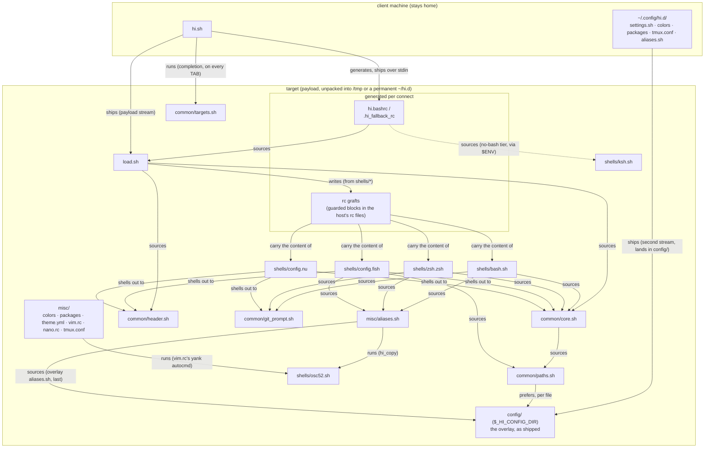

# hi.sh -> sshrc supercharged


[](https://github.com/ivylikethevine/hi.d/actions/workflows/coverage.yml)


**One config directory to rule them all, uniting all shells from all hosts!**

_Don't `ssh`ush your hosts, say `hi`!_


More of these — every backend (ssh with a permanent install, docker, podman, nomad, kubernetes) across a
variety of shells on both sides — [just below](#every-target-the-same-session). How it compares to `sshrc`,
`xxh`, `kyrat` or `chezmoi`, including where one of those is the better tool:
[hi.d and the alternatives](#hid-and-the-alternatives).

The payload badge is enforced, not aspirational: the bench suite rebuilds the real payload (`$_HI_PAYLOAD`
only — no tests, docs or CI ever ride along) and fails CI when the badge drifts more than a kilobyte.

## Every target, the same session

The pitch is that `hi` behaves identically whatever is on the other end — an
ssh host, a container, an allocation, a pod — and whatever shell each side
runs. One GIF per backend, deliberately varying both sides, each rendered from
the tape beside it (`vhs docs/tapes/<name>.tape` from the repo root, with the
backend running and `hi` on PATH; `docs/tapes/fixtures.sh` builds every target
the tapes connect to, `fixtures.sh down` removes them). Manual artifacts,
reviewed by eye — regenerate whenever the header or prompt changes.

Two things to get right when you do: `hi` on `$PATH` must be _this_ checkout
(`/usr/bin/hi` may point elsewhere), and the target image builds from `HEAD`,
so uncommitted work shows on the client side of the GIF but not the target's.
Render from a commit, or set `HI_DEMO_SOURCE=worktree`.

### ssh, with a permanent install

The target carries its own `~/hi.d`, so nothing ships over the wire — hi
loads the tree in place and leaves it alone on exit. Client: bash.


### docker

A debian/bash container, then an alpine box whose only real shell is zsh —
hi probes and falls back without being told. Client: zsh.


### podman

A fish-only alpine container from a fish client: no bash anywhere in the
loop. Same session, same code path as docker.


### nomad

A dev agent, one docker-driver job, and `hi <alloc-id-prefix>` straight into
the allocation. Client: bash.


### kubernetes

A kind cluster and a bare alpine pod — busybox ash is all it has, which is
hi's aliases-only fallback. Client: zsh.


## Requirements

- **Client**: `bash` and `base64` (for ssh targets - armors the bootstrap payload through the login shell; coreutils, busybox, macOS/BSD and Git Bash all ship one) or `docker`/`podman`/`nomad`/`kubectl` for the container/alloc/pod backends.
- **bash version**: 3.2 or newer, on both ends - what macOS still ships, so hi stays clear of every bash-4-only construct: no `mapfile`/`readarray` (`_hi_read_lines` in `common/core.sh` does that job), no associative arrays, no namerefs, no `${x,,}`. Enforced twice: `tests/shells/shellcheck_test.sh` greps for those constructs, and `tests/targets/ssh_test.sh` runs a real bash 3.2 container target and fails on so much as one shell error.
- **Target**: `base64` for ssh targets (effectively everywhere - coreutils, busybox, macOS/BSD); nothing extra for container/alloc/pod targets. `bash` gets the full experience (header, colors, git prompt, aliases, vim/nano configs); without it `hi` still lands you in the best available shell (`zsh` > `fish` > `ksh` > `sh`) with the aliases and, on the POSIX tiers, a colored prompt - rather than failing outright.
- Everything else (client and target) is plain POSIX/bash/zsh/fish shell - no compiled artifacts, no package manager, no build step.

### How it works

1. `hi.sh` runs on the client, archives `hi.d/` and sends it to the target, which unpacks it into a `/tmp` directory. Left out: `hi.sh` itself, `.git`, `scripts/`, `tests/`, `docs/`, `.github/`, this README and the editor/tooling dotfiles — `$_HI_PAYLOAD` at the top of `hi.sh` is the authoritative allow list. `_HI_ROOT` is `$INSTALL_DIR/hi.d` on the client, `$_HI_HOME/hi.d` on the target.
   Your `settings.sh`, `colors`, `packages`, `tmux.conf` and `aliases.sh` live outside the tree (see [Configuration](#configuration)) and follow in a second, much smaller archive — `$_HI_OVERLAY_FILES` in `hi.sh`, `$_HI_CONFIG_DIR` on the target. It lands in a `config/` of its own beside `misc/` rather than over it, so your `aliases.sh` stays additive. Nothing is sent if you have overridden nothing.
   The tar, `hi.sh` and the bootloader are each base64-armored, assembled into one script, armored again, and written over the **stdin** of the first of two calls multiplexed on one ssh connection; the second runs it. Not as an argv entry, which it used to be: Linux caps a single one at 128KB regardless of `ARG_MAX`, and the payload had grown within a few kilobytes of that. The size hi prints on connect is that armored total — roughly 4/3 of the gzipped payload the badge measures.
2. On the target, `$_HI_ROOT/hi.bashrc` sources `$_HI_ROOT/load.sh` and calls `load`.
3. `load.sh` prints the header, appends hi's shell configs to the host's own rc files, and starts a session in **your login shell** when hi styles it (bash, zsh or fish), else the first of `fish > zsh > bash` the target has. `_HI_SHELL_PREFERENCE` is that rule as a setting. The `zsh > fish > ksh > sh` order quoted elsewhere is the **no-bash fallback**: what's left when bash turned out to be missing.
4. When the session ends, `load.sh`'s `trap` strips those additions back out, and the `/tmp` directory is removed by the cleanup trap `hi.sh` set up on connect.
5. `hi <target> 'some command'` skips the interactive session and just runs the command there, like `ssh` does.

Steps 1-2 are plain POSIX under `sh`, so they work even where the target has no `bash`. hi still copies the whole tree, but hands off to the best plain shell available (`zsh`/`fish`/`ksh`/`sh`) with just the aliases loaded, rather than the full `load.sh`, which needs bash.

For ssh targets, hi first checks — over the same connection, so it costs no extra authentication — whether the target already has a permanent `~/hi.d` from `scripts/install.sh`. If so it skips the copy entirely, points `_HI_ROOT` at that copy, and leaves it in place at the end.

**_IMPORTANT: Local-only changes MUST stay in `~/.bashrc`, `~/.zshrc`, `~/.config/fish/config.fish`, etc. - anything in this directory is copied to every host you say `hi` to._**

#### How the files relate

The steps above are the prose; this diagram is the mechanism. Boxes are files
(or the few directories acting as one), and every arrow is one of the four ways
a file here ever reaches another:

- **sources** - shell `source`/`.`, same process
- **shells out** - a `bash -c "source ...; fn"` subprocess (how fish and nu
  reach code written in bash)
- **runs** - executed as its own subprocess, never sourced
- **generates / writes** - the file exists only because another wrote it

Deliberately coarse: file granularity, those four edge kinds. What is _not_
drawn matters too — `hi.sh` itself, `scripts/`, `tests/` and `docs/` never
ship; the payload is `$_HI_PAYLOAD`, and the bench suite enforces its size.



Three edges carry most of the design:

- **`hi.sh` never ships.** Everything on the target side has to work without
  it, which is why `load.sh` is the target's entry point and a peer of
  `hi.sh` at the tree root rather than a `common/` library.
- **fish and nu never source bash.** Their arrows to `core.sh`,
  `header.sh` and `git_prompt.sh` are _shell-outs_ - one implementation of
  the header, palette and git segment, rented per call, instead of three
  kept in sync (GLOSSARY: nu session tier).
- **`osc52.sh` is only ever run.** Both `hi_copy` and vim's yank autocmd
  execute it as a file at `$_HI_OSC52`, which is why the tmux/screen/zellij
  wrapping lives in one place and the file cannot be merged into
  `aliases.sh`.

The grafts deserve one footnote: each carries a tree-exists guard
(GLOSSARY: graft crash guard), so an arrow into a deleted `/tmp` tree goes
quiet instead of erroring - the diagram's dashed reality after a hard kill.

### Docker / Podman containers

`hi <name>` also works against a running docker or podman container. If `<name>` isn't a `Host` in `~/.ssh/config` but is a running container (by name or ID, docker checked first), `hi` copies `~/hi.d` in and chainloads `load.sh` exactly as the ssh path does, for an identical session. No armoring is needed (`docker exec -i`/`podman exec -i` pass stdin as raw bytes), and cleanup happens on exit. Podman's CLI is close enough to reuse the same command shapes. The container needs `bash` for the full experience; without it `hi` drops you into the best plain shell available (`zsh`/`fish`/`ksh`/`sh`) with the aliases and a warning.

### Windows hosts

`hi <target>` works against Windows OpenSSH targets too, at whatever level the target supports:

- **WSL, Git Bash, Cygwin or MSYS2 reachable on `PATH`**: the full experience (header, colors, git prompt, aliases) - same code path as any other ssh host.
- **Stock Windows OpenSSH with no `bash` at all**: `hi` falls back to a plain interactive PowerShell session (no hi.d styling - that's bash-only) rather than failing outright. It still costs one authentication: hi writes its bootloader over the first of two calls multiplexed on the _same ssh connection_, and a target where that write cannot run `sh -c` is a target with no POSIX shell, which is exactly what the fallback is for. `DefaultShell` set to PowerShell lands in the same place.

**Installing hi _on_ Windows:** use WSL. The `.deb` from the releases page installs into a WSL distribution unchanged - `/etc/profile.d/hi.d.sh`, `/usr/bin/hi`, everything as on any Debian - and WSL is where a Windows developer already using `ssh`/`docker`/`kubectl` most likely works. Native channels (Scoop and friends) are assessed under [docs/PACKAGING.md](docs/PACKAGING.md#windows-channels) and wait on a green client-side Windows CI job.

### Nomad allocations

`hi <alloc-id>` also works against a running Nomad allocation (matched by ID/prefix, after the ssh-host and container checks) - same session, same code path as docker. Since `nomad alloc exec` has no `docker cp`/`-e` equivalent, files stream in with `exec -i` + `cat >` and env vars go through a `sh -c "export ...; exec ..."` wrapper. Multi-task allocations would need `nomad alloc exec -task <name>`, which `hi` doesn't pass through, so they need a single unambiguous task.

### Kubernetes pods

`hi <pod-name>` also works against a running Kubernetes pod (checked last, after ssh/docker/podman/nomad) - same idea again, using `kubectl exec` with `--` separating its own flags from the remote command. Uses whatever context/namespace your `kubectl` is currently pointed at; like Nomad's multi-task allocations above, a multi-container pod needs `-c <name>` to pick one, which `hi` doesn't pass through, so it needs a single unambiguous container (`kubectl` falls back to the pod's first container with a warning rather than failing outright).

### Compatibility

Three questions, because hi answers them at three different moments. **Legend:** ✅ exercised by a suite on
every run · 🟡 expected to work, nobody has proven it · ⚠️ works, reduced · ❌ not supported.

**1. The target's OS** — can hi land a session there at all?

| target OS                                     | result                                                                                                                                                    | proven by                                                                                   |
| --------------------------------------------- | --------------------------------------------------------------------------------------------------------------------------------------------------------- | ------------------------------------------------------------------------------------------- |
| Linux, glibc (Debian/Ubuntu/Fedora/Arch…)     | ✅ full session                                                                                                                                           | `tests/targets/ssh_test.sh`, on Debian bookworm                                             |
| Linux, musl + busybox (Alpine…)               | ✅ full session with `bash` installed, ⚠️ aliases-only without                                                                                            | `ssh_test.sh`, on Alpine 3.20                                                               |
| macOS                                         | 🟡 full session — bash 3.2 is what it ships, and the suite runs a real bash 3.2 target; the client half (BSD `sed`/`mktemp`/`base64`) is unit-tested only | `ssh_test.sh` bash-3.2 case; `.github/workflows/macos-e2e.yml` is written but has never run |
| WSL                                           | 🟡 it is Linux, and the `.deb` installs into it unchanged                                                                                                 | —                                                                                           |
| Windows, with Git Bash/Cygwin/MSYS2 on `PATH` | 🟡 full session, same code path as any ssh host                                                                                                           | `.github/workflows/windows-e2e.yml`, written, never run                                     |
| Windows, stock OpenSSH (`cmd.exe`/PowerShell) | ⚠️ plain PowerShell session, no hi styling — the fallback is deliberate, not a failure                                                                    | same, never run                                                                             |
| \*BSD, Solaris/illumos                        | 🟡 nothing in hi is Linux-specific past the header's `/proc` probes, which degrade to `?`                                                                 | —                                                                                           |

**2. The target's _login_ shell** — the one sshd hands hi's command to, before any of hi runs.

| login shell                                      | result | note                                                                                                              |
| ------------------------------------------------ | ------ | ----------------------------------------------------------------------------------------------------------------- |
| `bash`, `sh`, `dash`, busybox `ash`              | ✅     | the ordinary case                                                                                                 |
| `zsh`                                            | ✅     |                                                                                                                   |
| `fish`                                           | ✅     | the reason hi's remote command is wrapped in `sh -c '…'`: fish parses neither `{ …; }` nor `\|\|` the way sh does |
| `ksh` (ksh93/mksh/pdksh), `tcsh`/`csh`           | 🟡     | they only have to run one `sh -c` command; nothing tests them                                                     |
| `nushell`, `elvish`, `xonsh`, `ion`, `oil`/`osh` | 🟡     | same — one command, no shell-specific syntax in it                                                                |
| PowerShell, `cmd.exe`                            | ⚠️     | no POSIX shell to write the bootloader with, so hi falls back to a plain PowerShell session                       |

**3. The shell you end up _in_** — what hi hands you once it is on the target.

| session shell                             | result                                                                | note                                                                                                                                                                                                                                                                                                                                                                                                                     |
| ----------------------------------------- | --------------------------------------------------------------------- | ------------------------------------------------------------------------------------------------------------------------------------------------------------------------------------------------------------------------------------------------------------------------------------------------------------------------------------------------------------------------------------------------------------------------ |
| `bash` ≥ 3.2                              | ✅ full: header, prompt, git status, aliases, editor configs          | 3.2 is the floor because macOS still ships it                                                                                                                                                                                                                                                                                                                                                                            |
| `zsh`                                     | ✅ full                                                               | `shells/zsh.zsh`                                                                                                                                                                                                                                                                                                                                                                                                         |
| `fish`                                    | ✅ full                                                               | `shells/config.fish`                                                                                                                                                                                                                                                                                                                                                                                                     |
| `sh`/`dash`/`ash` (no bash on the target) | ⚠️ aliases and a colored `user@host` prompt, with a warning saying so | no header and no git segment - those need bash                                                                                                                                                                                                                                                                                                                                                                           |
| `ksh`/`mksh` (no bash on the target)      | ⚠️ aliases, the colored prompt **and a live git segment** - no header | it reads `$ENV` as the `sh` tier does, plus `shells/ksh.sh`: ksh93 and mksh expand `$( )` when the prompt is _printed_, which is what lets the segment be live where busybox `ash` cannot have one. The header needs bash. `tests/targets/ssh_test.sh` renders the segment against a real mksh                                                                                                                           |
| `nushell`                                 | ⚠️ header, prompt, git segment and a **subset** of the aliases        | `shells/config.nu`. Needs `bash` on the target: nu can source none of `common/`, so the header, palette and git segment are rendered by shelling out to it, exactly as `config.fish` does. Chosen when nu is your _login_ shell or you name it in `_HI_SHELL_PREFERENCE` - never handed to someone whose login shell is bash. The alias subset, and what was left out and why, is the GLOSSARY's "nu alias subset" entry |
| `elvish`, `xonsh`, `ion`, `oil`/`osh`     | ❌                                                                    | see below                                                                                                                                                                                                                                                                                                                                                                                                                |
| PowerShell                                | ❌                                                                    | bash-only by design                                                                                                                                                                                                                                                                                                                                                                                                      |

**Shells hi does not style yet.** Each would need its own rc in `shells/` (prompt, aliases, completion) plus a
tier in the fallback ladder in `hi.sh`'s `_hi_remote_suffix` and `load.sh`'s `load()`.

| shell        | why it is not here                                                                                                      | what it would take                                                                                                                                                                                                                                       |
| ------------ | ----------------------------------------------------------------------------------------------------------------------- | -------------------------------------------------------------------------------------------------------------------------------------------------------------------------------------------------------------------------------------------------------- |
| `elvish`     | same shape, smaller audience                                                                                            | a `shells/rc.elv`                                                                                                                                                                                                                                        |
| `xonsh`      | Python, so the prompt and aliases would be a third implementation                                                       | a `shells/rc.xsh`                                                                                                                                                                                                                                        |
| `ksh`/`mksh` | **all but the header** — a tier in the no-bash ladder, the POSIX prompt, the aliases, and `shells/ksh.sh`'s git segment | the header, and only the header. `common/header.sh` is bash, and this tier is defined by bash being absent, so it would have to be written a second time in POSIX and then kept in sync forever - the git segment was worth that, a second header is not |
| `tcsh`/`csh` | different rc syntax and no `$ENV` equivalent                                                                            | its own rc, and honestly: ask whether anyone wants it                                                                                                                                                                                                    |
| PowerShell   | not a POSIX shell; the greeting hi prints there is the whole extent of it                                               | a separate project, really                                                                                                                                                                                                                               |

Using one of these as a _login_ shell still works — hi lands you in bash (or the best of zsh/fish/sh) for the
session. Only the session shell is limited.

**If you use a shell framework**, hi lands you in your own login shell, so it loads normally — that is what
`_HI_SHELL_PREFERENCE`'s default (`login fish zsh bash`) means. `tests/targets/framework_test.sh` tests
oh-my-zsh, powerlevel10k, starship and bash-it against hi, each asserting the session comes up with no shell
errors and that hi neither changed zsh's array base under them nor dropped their `PROMPT_COMMAND`.

## hi.d and the alternatives

An honest look at what else solves this problem, where hi.d is genuinely
different, and where another tool is the better one. Written for someone
deciding whether to use hi.d, not to sell it.

### The problem being solved

You have a shell you have spent years tuning, and you spend your day on
machines that are not yours: production boxes, a colleague's server, a jump
host, a container that will not exist in an hour. There you get `sh-4.4$` and
no `ll`.

There are two families of answer.

**Install your config there.** Dotfile managers — [chezmoi], [yadm], [GNU Stow],
[dotbot], [rcm] — or config management like Ansible. These are excellent, and
hi.d does not compete with them: they assume the machine is yours, that you'll
be back, and that leaving files behind is fine. That fails for a shared
production host, a box you touch once, or a container. The line blurs at the
edge — chezmoi's `--one-shot` applies dotfiles to an ephemeral machine then
deletes chezmoi, and VS Code devcontainers can clone a dotfiles repo into every
container — but both need the _target_ to reach your repo over the network,
both leave the files behind, and neither does anything per-session. hi.d pushes
from the client, needs no network on the target, and cleans up.

**Carry your config with you, per session.** The tool ships your config over the
connection, uses it for that session, and gets out. That is the family hi.d is
in, and everything below is a member of it.

A third thing that looks similar but is not: **terminal emulators that help
with ssh**, like [kitty's ssh kitten] and wezterm's ssh domains (which go
further, with an optional persistent `wezterm-mux-server` on the remote). Those
solve the adjacent and very real terminfo/shell-integration problem — kitty's
copies the `xterm-kitty` terminfo database, enables shell integration, and can
copy files you list. If your pain is "backspace is broken over ssh", that is
the fix, and it composes with hi.d rather than competing. hi.d handles the
terminfo half itself (`_hi_remote_preamble` probes the target's terminfo tree,
falling back to `xterm-256color`) precisely so it doesn't depend on your
terminal.

### The direct alternatives, side by side

|                                     | **hi.d**                                                  | **[sshrc]**                                                                                     | **[xxh]**                                                | **[kyrat]**                     | **[sshdot]**             |
| ----------------------------------- | --------------------------------------------------------- | ----------------------------------------------------------------------------------------------- | -------------------------------------------------------- | ------------------------------- | ------------------------ |
| Written in                          | POSIX/bash shell                                          | shell                                                                                           | Python                                                   | bash                            | shell                    |
| Client needs                        | `bash` 3.2+, `base64`                                     | bash, ssh                                                                                       | a Python install (pip/pipx/conda) or the portable binary | `bash` **≥ 4.0**, GNU coreutils | shell, ssh               |
| Target needs                        | `base64`; `bash` for the full session                     | shell                                                                                           | Linux **x86_64 only**                                    | shell                           | shell                    |
| Target OS                           | Linux (glibc + musl), macOS/BSD, Windows via WSL/Git Bash | broad                                                                                           | Linux x86_64                                             | Linux, macOS                    | broad                    |
| Installs on target                  | nothing                                                   | nothing                                                                                         | a portable shell + plugins under `~/.xxh`                | nothing                         | nothing                  |
| Cleans up on exit                   | yes, automatically                                        | leaves `/tmp` dir                                                                               | no — delete `~/.xxh` yourself                            | yes, automatically              | leaves files             |
| Size ceiling                        | ~39KB gzipped, enforced by CI                             | **~64KB and the server may block you**                                                          | large — it uploads whole shells                          | small                           | none (that is its point) |
| Non-ssh targets                     | **docker, podman, nomad, k8s**                            | no                                                                                              | no                                                       | no                              | no                       |
| Can give you a shell the host lacks | no                                                        | no                                                                                              | **yes**                                                  | no                              | no                       |
| Maturity                            | pre-1.0, not yet published to any channel                 | **original deleted from GitHub**; [cdown's] fork is the maintained line, argv ceiling inherited | mature, active                                           | quiet                           | quiet                    |

### Tool by tool

#### sshrc — the ancestor

hi.d is a fork of [sshrc] (via [cdown's] and [danrabinowitz's] lines), and the
core idea is unchanged: tar your config, base64 it, hand it to the login shell,
source it on the far side. Russell Stewart's original repository was deleted
from GitHub outright — not archived — so the links here point at [cdown's]
fork, the self-described maintained continuation, which carries the design
(64KB argv ceiling included) unchanged.

**Where sshrc still wins:** it is smaller and simpler, and simplicity is a real
feature in something that runs on every host you touch. If you just want your
`.bashrc` and `.vimrc` over there, sshrc does it in a fraction of the code, and
you can read all of it in one sitting.

**Where hi.d went further, and why:**

- **Transport.** sshrc's lineage passes the payload as an argv entry. Linux
  caps a single one at 128KB regardless of `ARG_MAX`, and sshrc's own README
  warns that past ~64KB "the server may block your sshrc attempts". hi.d writes
  it over **stdin** of the first of two calls multiplexed on one ssh
  connection, removing that ceiling as a design constraint rather than
  documenting it as a caveat.
- **Cleanup.** sshrc copies into `/tmp` and leaves it. hi.d's `load.sh` traps
  on exit, strips its lines back out of the host's rc files and removes the
  tree, so a machine you visited looks untouched.
- **It does not just copy files.** sshrc sources whatever you point it at. hi.d
  ships a designed session — header, hashed per-host colors, a git prompt,
  aliases, editor configs — degrading in defined tiers when the target cannot
  support all of it.

#### xxh — the one that solves a harder problem

[xxh]'s pitch is different and more ambitious: it uploads a **portable build of
the shell itself**, so you can use fish or zsh on a host that has neither.

**Where xxh wins outright:** that capability. hi.d cannot give you a shell the
target lacks — its no-bash ladder (`zsh > fish > ksh > mksh > sh`) picks the
best of what is installed and says so. If you need _your_ shell on a
locked-down box that ships only `sh`, xxh is the answer and hi.d is not; its
plugin model is also more principled than copying dotfiles blind.

**Where hi.d wins:**

- **Reach.** xxh targets "Linux on x86_64" — no ARM, no macOS, no BSD. hi.d's
  floor is bash 3.2 (what macOS still ships) and `base64`, and its suite runs
  real Debian, Alpine/musl and bash-3.2 targets every time.
- **Weight.** xxh uploads shells; hi.d uploads ~39KB and a CI job fails if that
  number drifts more than a kilobyte from the badge.
- **Footprint.** xxh is hermetic but persistent — `~/.xxh` stays until you
  delete it. hi.d removes itself when the session ends.
- **Dependencies.** xxh needs Python on the client. hi.d needs a shell you
  already have.

#### kyrat — closest in spirit

[kyrat] is the nearest neighbour: a bash ssh wrapper, base64+gzip through the
command line, cleanup on exit, `KYRAT_SHELL` to pick bash/zsh/sh. If the table
above looks like a description of hi.d, that is because it nearly is.

The differences are narrow and concrete. kyrat requires **bash ≥ 4.0**, ruling
out macOS's system bash — the exact constraint hi.d contorts itself to respect
(no `mapfile`, no associative arrays, no namerefs, enforced by a lint grep and
a real bash-3.2 container in CI). kyrat spawns bash, zsh or sh; hi.d styles
bash, zsh, fish and nushell, and gives the POSIX tiers a colored prompt and —
for ksh/mksh — a live git segment. And kyrat is ssh-only.

#### sshdot

[sshdot] is sshrc without the size limit, achieved by not squeezing through the
command line. Narrower in scope than hi.d; the honest summary is that it solves
the one problem it names.

### Adjacent tools, and how they compose

None of these are alternatives — they touch the same session from a different
side. Listed because people conflate them with the family above, or because the
composition has a wrinkle worth knowing.

- **[mosh] / [Eternal Terminal]** replace ssh as the _transport_, to survive
  roaming and dropped connections. hi's ssh path is two calls multiplexed on
  one OpenSSH connection, which neither of them is, so `hi` cannot ride them.
  The composition that works: install hi.d permanently on the target
  (`scripts/install.sh`), then mosh in — and note `hi_copy` over mosh needs
  mosh ≥ 1.4, its first release with OSC 52.
- **[Warp]'s SSH extension and "Warpify"** attack the same pain from the
  terminal side: a persistent remote component under `~/.warp*` plus a hook
  line in the remote's rc files. It ships Warp's features, not your config.
  The two coexist — hi.d touches only its own marker-delimited lines.
- **[atuin] / [hishtory]** carry the one thing hi.d deliberately does not:
  your shell history, synced across machines you own. Complementary — and
  since a target running one binds the same `Ctrl-R` hi's session lands you
  at, the framework e2e suite boots a real atuin (plus fzf, zoxide, direnv,
  mise) target and asserts its hooks survive hi's session.
- **[chezmoi]/[yadm] as the overlay's keeper.** hi.d's per-user overlay lives
  at `~/.config/hi.d/`. Keep it in your dotfile manager and the two compose
  cleanly: chezmoi versions it, hi ships it to every target, per-session.
- **[sshx]** shares a terminal you already have with other people through a
  browser — despite the name, not in this family at all. An sshx session
  started inside a hi session simply shares the styled session.
- **[distrobox]/toolbox** containers share your real `$HOME`, so `hi` into one
  grafts into the same rc files your host shells read. The exit trap strips
  them as everywhere else; an uncleanly killed session is the one case where
  graft lines outlive their tree in a file you care about, which is why every
  graft is wrapped in a tree-exists guard that stands down silently
  (`load.sh`'s `configure_files`, proven by the load suite).

### What actually makes hi.d different

Two things, and it is worth being precise because the rest is degree, not kind.

**1. It is not an ssh tool.** Every alternative above is an ssh wrapper. `hi`
resolves a name through a ladder — ssh host, docker container, podman, nomad
allocation, kubernetes pod — and gives the _same session_ on whichever it
finds. `hi web-1` is your shell whether `web-1` is a `Host` in `~/.ssh/config`
or a pod in the namespace your `kubectl` points at. For anyone moving between a
server and the containers on it that is the feature, and nothing else in this
space does it.

**2. It degrades in stated tiers rather than failing or lying.** The
[compatibility tables](#compatibility) answer three questions — can hi land a
session here, what must your _login_ shell survive, what do you end up in — and
mark every cell proven-by-a-suite, expected, reduced, or unsupported. A target
with no bash gets aliases, a colored prompt, and a warning saying so; a Windows
OpenSSH host with no POSIX shell gets a plain PowerShell session rather than an
error. That stance is why the honest cells (🟡 "nobody has proven it") are in
the table at all.

Secondary but real: a per-user config overlay (settings, colors, packages,
aliases) that rides along without dirtying the tree, `hi --doctor` for when
something is slow, `--tmux` so a dropped connection detaches instead of losing
work, and detecting a permanent `~/hi.d` on the target to use in place.

### Where hi.d is the wrong choice

- **You want your shell on a host that does not have it.** Use [xxh].
- **The machine is yours and you will be back.** Use [chezmoi] or [yadm] —
  per-session copying is the wrong shape for a machine you own.
- **You want the smallest thing that works.** [sshrc] or [kyrat] are less code,
  and less code on every host you touch is a legitimate preference.
- **Your problem is terminfo or shell integration, not config.** Use your
  terminal's own helper — [kitty's ssh kitten] is excellent at exactly that.
- **You need nushell, elvish or xonsh on a target with no bash.** hi.d's
  nushell support needs bash there (it shells out for the header, palette and
  git segment); elvish and xonsh are not styled at all.
- **You need something published and stable today.** hi.d is pre-1.0 and on no
  channel yet — you install from a checkout or a release artifact. The
  alternatives have been installable for years.

### Sources

- [sshrc] — hi.d's ancestor; the link is [cdown's] maintained fork, the
  original having been deleted from GitHub ([danrabinowitz's] is the other
  line hi.d descends through)
- [xxh] — portable shells over ssh
- [kyrat] — bash ssh wrapper with cleanup
- [sshdot] — sshrc without the size limit
- [kitty's ssh kitten] — terminfo and shell integration
- [chezmoi], [yadm], [GNU Stow], [dotbot], [rcm] — the install-it-there family

[sshrc]: https://github.com/cdown/sshrc
[cdown]: https://github.com/cdown/sshrc
[cdown's]: https://github.com/cdown/sshrc
[danrabinowitz]: https://github.com/danrabinowitz/sshrc
[danrabinowitz's]: https://github.com/danrabinowitz/sshrc
[xxh]: https://github.com/xxh/xxh
[kyrat]: https://github.com/fsquillace/kyrat
[sshdot]: https://github.com/PFacheris/sshdot
[kitty's ssh kitten]: https://sw.kovidgoyal.net/kitty/kittens/ssh/
[chezmoi]: https://www.chezmoi.io/
[yadm]: https://yadm.io/
[GNU Stow]: https://www.gnu.org/software/stow/
[dotbot]: https://github.com/anishathalye/dotbot
[rcm]: https://github.com/thoughtbot/rcm
[mosh]: https://mosh.org/
[Eternal Terminal]: https://eternalterminal.dev/
[Warp]: https://docs.warp.dev/terminal/warpify/
[atuin]: https://atuin.sh/
[hishtory]: https://github.com/ddworken/hishtory
[sshx]: https://sshx.io/
[distrobox]: https://distrobox.it/

## Installation/Usage

- `hi.d/scripts/install.sh` (re-run it any time; it repairs its own lines, even if hi.d moved) - before touching your shell rc files it validates whichever of `~/.bashrc`, `~/.zshrc` and `~/.config/fish/config.fish` are installed with each shell's own syntax checker, and asks whether to continue if any have issues
  - or `basher install ivylikethevine/hi.d` if [basher](https://github.com/basherpm/basher) manages your shell packages: it clones the repo and links `bin/hi` onto PATH (the shim exports `_HI_HOME` for the cellar location). The rc wiring, toggles and validation are still `scripts/install.sh`'s job - run it from the cloned package for the full setup
- reload your shell!
- run `hi_configure` any time afterward to revisit the feature toggle prompts - header, prompt, personal settings, git status, editors, aliases, header details, terminal width, and whether hi styles this machine too or only the hosts you say `hi` to - without touching the shell rc wiring. Answers land in `~/.config/hi.d/settings.sh`; see [Configuration](#configuration) below
- run `hi_check_configs` any time to just re-run that shell rc validation, without the rest of the install
- run `hi --help` (or `hi -h`) for the short version of all of this: the synopsis, the target resolution order, and every flag hi answers itself. `man hi` is the long version. Everything hi does not answer is passed to `ssh` unchanged
- run `hi --version` to see what is installed - the packaged version, or `git describe` in a checkout; the doctor and the connect header show it too
- run `hi --tmux <target>` to have the session live inside a named tmux on the target, so a dropped connection detaches instead of losing work - run it again to reattach (`_HI_TMUX_ATTACH=1` makes it the default, `--no-tmux` turns it off, `_HI_TMUX_SESSION` names the session). Offered only where hi.d is permanent on the target: a disposable tree is deleted when the session ends, and hi says so rather than leaving a tmux pointing at nothing
- run `hi_doctor` (or `hi --doctor <target>`) when something is slow or failing: it reports the tree, the config overlay, every backend probed and timed with the same ceilings the header and completion use, and - with a target - which backend the name resolves to plus an ssh reachability/tooling check, all read-only
- configure `~/.ssh/config` tags via sshm
- [optional] pin specific colors in `~/.config/hi.d/colors` - everything else gets a color automatically. Copy `hi.d/misc/colors` there to start from the shipped defaults
  - run `hi_color_preview` to preview what every ssh host/your user resolves to
- [optional] copy `hi.d/misc/packages` to `~/.config/hi.d/packages` and edit it to your preferences
- say `hi`!
- [optional] modify `~/hi.d/misc/*` and `~/hi.d/shells/*` to your liking - though anything with an overlay (`settings.sh`, `colors`, `packages`, `tmux.conf`, `aliases.sh`) is better edited in `~/.config/hi.d/`, which keeps the checkout clean for `hi_update`
  - tip: `~/hi.d` is a git checkout, so if you do edit it, push to your own fork and clone that on your next device - same setup everywhere, kept in sync by `hi_update`
- done with it? `hi.d/scripts/uninstall.sh` (aliased to `hi_uninstall`, a one-line shim onto `install.sh --uninstall`) is the install's inverse: it strips hi's lines back out of your rc files, removes the `settings.sh` it wrote, and unlinks `/usr/bin/hi`. It leaves the `hi.d` directory alone, and your `colors`/`packages` too - delete those yourself if you want them gone

---

### Verifying a release download

Releases ship a `SHA256SUMS`, signed build provenance, and a detached [minisign](https://jedisct1.github.io/minisign/)
signature over the sums (the offline half — no `gh`, no network, one static public key):

```sh
sha256sum -c --ignore-missing SHA256SUMS                        # the bytes match the release
minisign -Vm SHA256SUMS -P 'RWT-PLACEHOLDER-see-ROADMAP-secrets-and-keys'
gh attestation verify hi.d_*_all.deb --repo ivylikethevine/hi.d # which CI run built them
```

<!-- The -P value above is a placeholder until the first release's keypair is
generated - the minisign entry in docs/ROADMAP.md's "Secrets & keys" replaces it. -->

---

Usage: `hi foo` (just like ssh!)

---

Reminder - place local only changes after the "`# hi-config-end`" comment in the local files.

## Configuration

Your config lives **outside the checkout**, in `${XDG_CONFIG_HOME:-$HOME/.config}/hi.d/` (`$_HI_CONFIG_DIR`).
`colors` and `packages` there override the tree's copies, one file at a time - anything you haven't
overridden keeps tracking the default the tree ships, so `hi_update` still delivers changes to the rest.
`settings.sh` has no in-tree counterpart at all: `hi_configure` only ever writes it here.

| overlay file                 | overrides        | what it is                                                                                                                            |
| ---------------------------- | ---------------- | ------------------------------------------------------------------------------------------------------------------------------------- |
| `~/.config/hi.d/settings.sh` | -                | what `hi_configure` writes                                                                                                            |
| `~/.config/hi.d/colors`      | `misc/colors`    | your color pins                                                                                                                       |
| `~/.config/hi.d/packages`    | `misc/packages`  | what the package check looks for                                                                                                      |
| `~/.config/hi.d/tmux.conf`   | `misc/tmux.conf` | your tmux config                                                                                                                      |
| `~/.config/hi.d/aliases.sh`  | -                | your own aliases, sourced **after** `misc/aliases.sh` so yours win - additive, never a replacement, and in the same POSIX+fish subset |

This is what keeps configuring hi.d from dirtying the checkout (so `hi_update`'s `git pull` keeps applying
cleanly), and why the tree never has to be writable at all - it can be root-owned, installed by a package
manager. All of it rides along to every host you say `hi` to, in its own small archive.

Want history on it? `hi_overlay_init` makes `~/.config/hi.d` a git repo _in place_: from then on
`hi_configure` commits its own settings writes, `hi_doctor` reports the commit count, and a push remote is one
`git remote add` away. Entirely optional. (Keeping the same directory in chezmoi or yadm works just as well -
see [hi.d and the alternatives](#hid-and-the-alternatives).)

Everything below is an environment variable, checked where it's used. `hi_configure` writes your answers to
`~/.config/hi.d/settings.sh`, which every shell sources ahead of `common/paths.sh` - a plain `#!/bin/sh` script
of `export NAME=value` lines, valid in sh, bash, zsh and fish alike. You never have to use `hi_configure`:
exporting any of these by hand works just as well, and takes precedence for that shell.

### Features

Each is **on by default**; set it to `1` to turn that piece off.

| variable                 | turns off                                                                                                                             |
| ------------------------ | ------------------------------------------------------------------------------------------------------------------------------------- |
| `_HI_DISABLE_HEADER`     | the whole connect/disconnect header, every line of it                                                                                 |
| `_HI_DISABLE_PROMPT`     | the colored `user@host` prompt, leaving your shell's own                                                                              |
| `_HI_DISABLE_PERSONAL`   | personal shell settings - history size, keybindings, completion tweaks                                                                |
| `_HI_DISABLE_GIT_STATUS` | the git segment in the prompt                                                                                                         |
| `_HI_DISABLE_EDITORS`    | the `vim`/`nano` config overrides                                                                                                     |
| `_HI_DISABLE_ALIASES`    | the personal aliases in `misc/aliases.sh` (not nu's subset - `alias` is parse-time there and cannot be gated; see `shells/config.nu`) |
| `_HI_DISABLE_OSC52`      | the OSC 52 clipboard - yanks in `vim` and the `hi_copy` alias                                                                         |
| `_HI_DISABLE_TMUX`       | the `tmux` config override (offered on permanent installs only)                                                                       |
| `_HI_DISABLE_LOCAL`      | all of the above **on this machine only** - hi still styles the hosts you visit                                                       |

`_HI_DISABLE_LOCAL` is the odd one out: "leave my own machine alone, but give me hi everywhere I connect to".
It's told apart from a real session by `_HI_REMOTE_SESSION`, which `load.sh` exports on a target and a local
shell's own rc never does.

`_HI_DISABLE_OSC52` turns off the one feature that reaches back _through_ the connection: a yank in `vim` on a
target, or anything piped into `hi_copy`, is base64'd into an [OSC 52](https://invisible-island.net/xterm/ctlseqs/ctlseqs.html#h4-Operating-System-Commands)
escape and written to the tty, so your local terminal emulator - not the host - puts it on **your** clipboard. No X11
forwarding, no clipboard daemon, nothing installed on the target. Only the unnamed register is sent, so `"ay` stays
local. Terminal support varies (tmux needs `set -g allow-passthrough on`; zellij handles OSC 52 itself, so under
`$ZELLIJ` the escape goes through raw and unwrapped), which is why it's a toggle like
everything else; `shells/osc52.sh` is the whole implementation if you want to read what gets emitted.

### tmux

`misc/tmux.conf` is reached the way `vim.rc` is - through an alias, `tmux -f <conf>` - and overridden the same
way, by dropping your own `~/.config/hi.d/tmux.conf`. Beyond the usual defaults it does one hi-specific thing:
it appends the `_HI_*` variables to tmux's `update-environment`, so a window opened **after** attaching gets a
shell that can still find hi. Without it, `tmux new-window` on a remote box gives a bare prompt, the tmux
server predating the connection and knowing nothing about `$_HI_HOME`.

Two limits worth stating plainly:

- `-f` is read when the tmux **server** starts, not when a client attaches, so attaching to an already-running
  server applies none of the config - tmux's rule, not hi's. The `update-environment` half still works, being
  refreshed on every attach.
- The alias is defined **only where hi.d is permanent** - your own machine, or a target where
  `scripts/install.sh` has been run. On a disposable target hi deletes the tree on exit and a detached tmux
  outlives the session, so every shell inside it would wake up reading a directory that is gone. Plain `tmux`
  still works there, without hi's config.

### Header details

Each is **on by default**; set it to `0` to hide that line. All are ignored when `_HI_DISABLE_HEADER=1`.

| variable               | hides                                                            |
| ---------------------- | ---------------------------------------------------------------- |
| `_HI_HEADER_BANNER`    | the `~~~ Connected [host] ~~~` line, on connect _and_ disconnect |
| `_HI_HEADER_TIMESTAMP` | the date/time line                                               |
| `_HI_HEADER_SYSINFO`   | the OS / CPU / RAM line                                          |
| `_HI_HEADER_IDENTITY`  | the git identity / containers / ssh key line                     |
| `_HI_HEADER_CHECK`     | the installed-packages check (`misc/packages`)                   |

### Everything else

| variable               | default               | what it does                                                                                                                                                                                                                                                                                                   |
| ---------------------- | --------------------- | -------------------------------------------------------------------------------------------------------------------------------------------------------------------------------------------------------------------------------------------------------------------------------------------------------------- |
| `_HI_MAX_WIDTH`        | `80`                  | terminal columns the header and banner are drawn to                                                                                                                                                                                                                                                            |
| `_HI_HOME`             | `$HOME`               | the **parent** of your `hi.d` directory - everything resolves `$_HI_HOME/hi.d`                                                                                                                                                                                                                                 |
| `_HI_TARGETS_TTL`      | `5`                   | seconds `hi <TAB>` reuses its target list for; `0` disables the cache                                                                                                                                                                                                                                          |
| `_HI_PROBE_TIMEOUT`    | `2`                   | seconds any one backend CLI gets, during completion and in the header                                                                                                                                                                                                                                          |
| `_HI_SSH_CONFIG`       | `~/.ssh/config`       | where ssh hosts and their `# Tags:` comments are read from                                                                                                                                                                                                                                                     |
| `_HI_ASCII`            | by locale             | `1` forces ASCII stand-ins for the banner/prompt/packages glyphs (`^ ok x` for `↑ ✓ ✗`), `0` forces the glyphs; unset asks the locale, so a `LANG=C` target degrades cleanly instead of printing mojibake                                                                                                      |
| `NO_COLOR`             | unset                 | not hi's variable but [the convention](https://no-color.org): any non-empty value renders everything - header, prompts, git segment - without color, and hi ships your client-side choice to the target next to `_HI_ASCII`                                                                                    |
| `_HI_PROMPT`           | unset                 | `starship` hands the prompt to [starship](https://starship.rs) when the target has it, keeping hi's header and aliases (bash/zsh/fish; nu keeps hi's prompt). Never auto-detected, and a target without starship silently keeps hi's own. hi does not ship starship - a multi-MB binary against a 39KB payload |
| `_HI_SHELL_PREFERENCE` | `login fish zsh bash` | which shell a session runs in: an ordered list of `bash`/`zsh`/`fish`/`nu`, plus `login` for "your own login shell". First one installed on the target wins; `bash` is the floor, since that is what `load.sh` needs to run at all. `nu` is never picked unless it is your login shell or you name it here     |
| `_HI_PROMPT_END`       | per shell             | the character each prompt ends with, when you want the same one everywhere; the three below win over it                                                                                                                                                                                                        |
| `_HI_PROMPT_END_BASH`  | `\$`                  | bash's prompt separator (`\$` is bash's own escape for "`$`, or `#` for root")                                                                                                                                                                                                                                 |
| `_HI_PROMPT_END_ZSH`   | `>`                   | zsh's prompt separator - zsh prompt escapes work here, so `%#` behaves as it does anywhere else in `PS1`                                                                                                                                                                                                       |
| `_HI_PROMPT_END_FISH`  | `\|`                  | fish's prompt separator; root still gets `#` regardless                                                                                                                                                                                                                                                        |
| `_HI_TERM_FALLBACK`    | `1`                   | on ssh targets missing a terminfo entry for your `TERM` (ghostty's `xterm-ghostty`, typically), swap it for `xterm-256color` before the session starts; `0` keeps the original `TERM`                                                                                                                          |

`_HI_TARGETS_TTL` and `_HI_PROBE_TIMEOUT` exist because completion runs on **every TAB** and the header runs
**before you get a shell**: a docker daemon that's down or a `kubectl` pointed at a dead cluster would
otherwise hang there with no upper bound.

## Testing

Run everything with `tests/test_runner.sh` (aliased to `hi_test` once installed) - it times each suite and prints a
colored pass/fail summary at the end:

```sh
tests/test_runner.sh                    # every suite
tests/test_runner.sh aliases shellcheck # just the named suite(s)
tests/test_runner.sh --group fast       # what CI runs on every push/PR
tests/test_runner.sh --host-report      # ...prefixed with what this machine is
tests/test_runner.sh --verbose          # every transcript, nothing collapsed
```

A passing suite's transcript collapses to one status line; `--verbose`
(`_HI_VERBOSE=1`) streams every suite's output live instead, which is what you want when a case fails only
under the runner.

`--host-report` (`_HI_HOST_REPORT=1`) prints bash, the OS, whether the userland is GNU/BSD/busybox, which tree
`$_HI_HOME` resolves to, which backends answer and the lint tools' versions before the first suite runs - the
questions asked every time a suite passes on one machine and fails on another. CI passes it on every job.

Four groups (`--group <name>`), matching CI's four jobs. `fast`: `aliases`, `alias_fallthrough`, `osc52`,
`tmux`, `shellcheck`, `install`, `packaging`, `hi`, `header`, `core`, `git_prompt`, `targets`, `paths`,
`color_preview`, `doctor`, `load`, `rc`, `test_lib`, `test_runner` — dependency-free, the first thing CI runs
on every push/PR (the last two are the harness testing itself). `bench`: hot-path timings checked against
ceilings. `e2e`: `ssh`, `ssh_disconnect`, `ssh_relay`, `docker`, `framework` — real throwaway containers
driving `hi.sh`'s actual connection paths, covering both halves of it (`_say_hi` and `_say_hi_container`).
`backends`: `podman`, `nomad`, `kube` — split from `e2e` because they need extra runner setup (podman, nomad,
kind) beyond docker; a separate, slower CI job. Every e2e/backends suite skips cleanly with a warning rather
than failing when its backend isn't installed — `--require-run` (what CI's e2e/backends jobs pass) turns a
skip into a failure instead. Every test script also runs directly, e.g. `tests/shells/shellcheck_test.sh`.

**Relaying.** `hi` chains: from a session on B you can `hi C`, and the second hop is a full hi session. That works
from a _disposable_ session too, because `hi.sh` rides every bash-capable one — it is not in the payload tar, but
both transports write it to the target alongside the tree. `ssh_relay` is the proof: A → B → C, config intact on the
final hop, cleanup traps firing on **both** B and C, on a clean exit and on the link being killed mid-relay. The one
tier that cannot relay is the container transport's bash-less fallback, which ships `aliases.sh` alone and never
loads `paths.sh` — there `hi` is simply not defined.

The tests are local-only: `tests/` is stripped from the payload, so `hi_test` on a target says so rather than
running (likewise `hi_install`, `hi_configure`, `hi_check_configs`, `hi_color_preview`). `hi_update` is the odd one
out — it needs a `.git`, absent both in a hi session and in a package-manager install, so it says where to update
instead of running `git pull` in a non-repo.

Any script here needs `_HI_HOME` set before it'll source correctly — point it at the _parent_ of your `hi.d`
checkout:

```sh
export _HI_HOME=/path/to/parent-of-hi.d
tests/test_runner.sh
```

## Packaging & releases

Everything needed to ship `hi` through a package manager lives in
[docs/PACKAGING.md](docs/PACKAGING.md): the one-time setup each channel needs
(cross-referenced from [docs/ROADMAP.md](docs/ROADMAP.md)'s human-action
checklists), cutting a release, and the per-channel publish steps (AUR,
Homebrew tap, basher/fisher, deb/rpm/apk) including the Windows channel
assessment. Nothing publishes on its own — the publishing job waits on a
manual approval, and the AUR and the Homebrew tap are copies made by hand
until their secrets exist.

## More docs

- [docs/GLOSSARY.md](docs/GLOSSARY.md) - the named idioms the code's `GLOSSARY:` comment tags point at; load-bearing for reading `common/`, and drift-checked by the lint suite
- [docs/CONTRIBUTING.md](docs/CONTRIBUTING.md) - the test harness and how a change should arrive (PR titles become release notes)
- [docs/SECURITY.md](docs/SECURITY.md) - reporting, and what hi touches on a target
- [docs/PACKAGING.md](docs/PACKAGING.md) - the publishing runbook: cutting a release, the per-channel steps, and the Windows channel assessment
- [docs/ROADMAP.md](docs/ROADMAP.md) - what is planned, what each item is blocked on, and the one-time setup the release channels wait on
- [docs/tldr.md](docs/tldr.md) - the draft tldr-pages submission; [docs/hi.1](docs/hi.1) is the man page every package installs

### File list

| file                                            | what it does                                                                                                                                                            |
| ----------------------------------------------- | ----------------------------------------------------------------------------------------------------------------------------------------------------------------------- |
| `hi.sh`                                         | runs on the client: pick the target, copy hi.d, chainload `load.sh`                                                                                                     |
| `load.sh`                                       | runs on the target: header, rc grafting, shell handoff, cleanup                                                                                                         |
| `common/paths.sh`                               | every path hi uses (the only file fish and sh both source)                                                                                                              |
| `common/core.sh`                                | the entry point every bash/zsh script sources: settings, paths, palette, `_hi_cecho`, color resolution                                                                  |
| `common/header.sh`                              | the connect/disconnect banner, shared by every shell, plus the `misc/packages` check it ends with                                                                       |
| `common/git_prompt.sh`                          | bash/zsh git prompt, matching fish's built-in `fish_vcs_prompt`                                                                                                         |
| `common/targets.sh`                             | every `hi` target (ssh/docker/podman/nomad/kube), for all three completions - cached and timeout-bounded                                                                |
| `shells/osc52.sh`                               | stdin to the _client's_ clipboard over OSC 52 - tmux/screen passthrough, raw under zellij - behind `hi_copy` and `vim.rc`'s yank autocmd, off via `_HI_DISABLE_OSC52=1` |
| `shells/bash.sh`                                | bash config                                                                                                                                                             |
| `shells/zsh.zsh`                                | zsh config                                                                                                                                                              |
| `shells/config.fish`                            | fish config                                                                                                                                                             |
| `shells/config.nu`                              | nushell config - shells out to bash for the header, palette and git segment                                                                                             |
| `shells/ksh.sh`                                 | the ksh/mksh tier's POSIX git segment, the one prompt piece written without bash                                                                                        |
| `misc/aliases.sh`                               | personal aliases shared by bash, zsh and fish - freely editable, off wholesale via `_HI_DISABLE_ALIASES=1`                                                              |
| `misc/vim.rc`, `misc/nano.rc`, `misc/theme.yml` | vim, nano and eza configs                                                                                                                                               |
| `misc/tmux.conf`                                | tmux config, reached via the `tmux` alias - override in `~/.config/hi.d/tmux.conf`, off via `_HI_DISABLE_TMUX=1`                                                        |
| `misc/packages`                                 | default for the packages check, as `cmd:priority[,alternative:priority]` - override in `~/.config/hi.d/packages`                                                        |
| `misc/colors`                                   | default color pins for hostnames/usernames/hosttags - override in `~/.config/hi.d/colors`                                                                               |
| `scripts/install.sh`                            | configure the local shells, install, update and uninstall - `--prefix`/`$DESTDIR` for packagers                                                                         |
| `scripts/uninstall.sh`                          | one-line shim onto `install.sh --uninstall` (`hi_uninstall`)                                                                                                            |
| `scripts/color_preview.sh`                      | preview what every ssh host/user resolves to (`hi_color_preview`)                                                                                                       |
| `scripts/doctor.sh`                             | pre-flight report: tree, config, timed backend probes, and a target's resolution + ssh reachability (`hi_doctor`, `hi --doctor`)                                        |
| `packaging/`                                    | build-time only, never installed: `mkpkg.sh`, `stamp.sh`, `bump.sh`, and the AUR/Homebrew/nfpm manifests                                                                |
| `bin/hi`                                        | the basher shim - resolves through the cellar symlink and exports `_HI_HOME`                                                                                            |
| `tests/test_runner.sh`                          | unified runner - times and summarizes every test below (or a chosen subset) (`hi_test`)                                                                                 |
| `tests/test_lib.sh`                             | the whole suite skeleton: asserts/counters, scratch dir, skip preamble, probe commands, poll/pty helpers                                                                |

The test suites are deliberately not repeated here: each suite's opening
comment block says exactly what it covers, and `tests/test_runner.sh --list-paths`
prints the live list — group, name, and path — so the truth can't drift the
way a second copy of it in this table once did.

#### Hostname, username, and group/tag colors

Every username and hostname gets a color deterministically derived from its name - nothing to generate, nothing that can go missing. To pin one instead, add a line to `~/hi.d/misc/colors` (`username,root,red` / `hostname,prod-db,yellow` / `hosttag,desktop,green`); `hosttag` entries match the _leftmost_ tag in a `# Tags: ...` comment directly above a `Host` line in `~/.ssh/config`. `hi_color_preview` shows what every ssh host and your user currently resolve to, in their actual colors.

##### Built from/with/in mind

- [sshrc](https://github.com/cdown/sshrc) - _from_ - (became `hi.sh`)
- [sshm](https://github.com/Gu1llaum-3/sshm) - _with_ - (optional, but _highly_ recommended to configure `~/.ssh/config` hosttags)
- [bat](https://github.com/sharkdp/bat) - _in mind_ - (essentially my reason to get the aliases.sh fallthrough logic to work as portably as possible)
- [fish](https://github.com/fish-shell/fish) - _with_ - (my preferred shell because its defaults/built-ins are extremely easy to understand, but one that is not POSIX-compliant)

##### AI Usage

Heavily inspired by: [Dictionarry/Profilarr's AI Transparency Statement](https://v2.dictionarry.dev/ai-transparency)

This started as code written entirely by [me](https://github.com/ivylikethevine), but I have used generative AI to write large parts of it. All of the code here is my _responsibility_ regardless: AI is a tool, not an owner of a project. I have personally understood, reviewed and approved all of the AI-generated code in this repository, and _mainline releases_ carry the same accountability to me as anything I write and publish myself.
