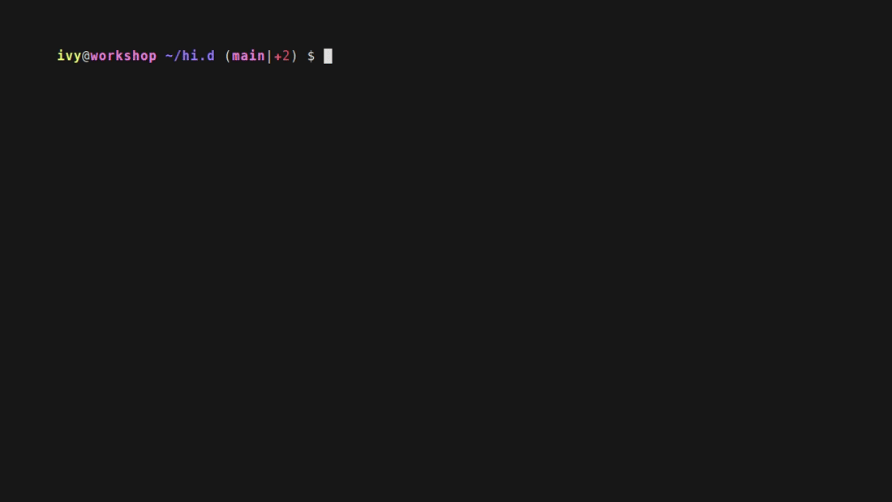
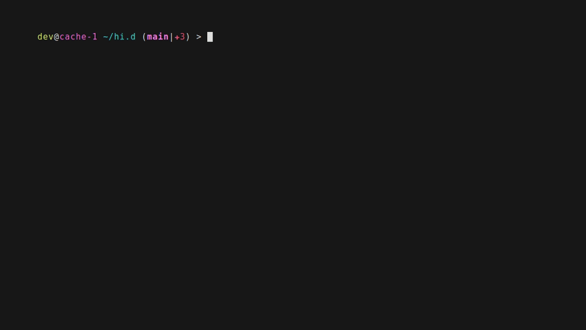
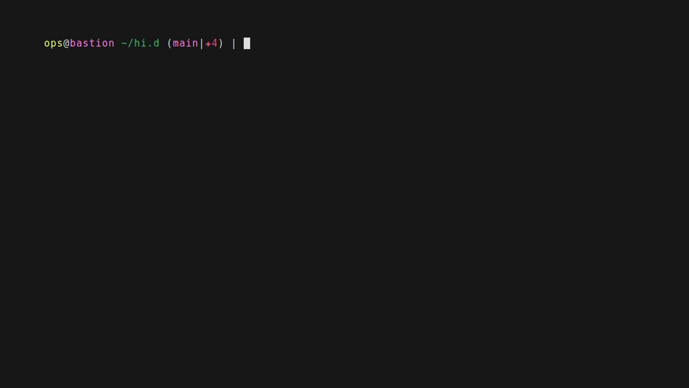
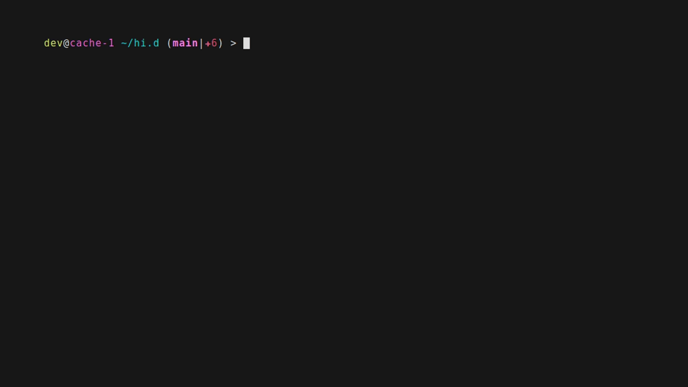

# hi.sh -> sshrc supercharged

---

## EXPERIMENTAL UNTIL v1.0.0-stable RELEASES

NOTE: Project is in active development, many things are subject to change
and this current state is not a representation of final, published quality.
This is a hobby project.

---

[](https://github.com/ivylikethevine/hi.d/actions/workflows/ci.yml)
[](https://github.com/ivylikethevine/hi.d/actions/workflows/ci.yml)
[](https://github.com/ivylikethevine/hi.d/actions/workflows/macos-e2e.yml)
[](https://github.com/ivylikethevine/hi.d/actions/workflows/windows-e2e.yml)
[](https://github.com/ivylikethevine/hi.d/actions/workflows/coverage.yml)


**One config directory to rule them all, uniting all shells from all hosts!**

_Don't `ssh`ush your hosts, say `hi`!_


## Contents

- [Every target, the same session](#every-target-the-same-session)
  - [ssh, with a permanent install](#ssh-with-a-permanent-install)
  - [docker](#docker)
  - [podman](#podman)
  - [nomad](#nomad)
  - [kubernetes](#kubernetes)
- [Requirements](#requirements)
- [Installation/Usage](#installationusage)
- [Configuration](#configuration)
  - [Hostname, username, and group/tag colors](#hostname-username-and-grouptag-colors)
  - [How it works](#how-it-works)
- [Built from/with/in mind](#built-fromwithin-mind)
  - [Docker / Podman containers](#docker--podman-containers)
  - [Nomad allocations](#nomad-allocations)
  - [Kubernetes pods](#kubernetes-pods)
  - [Windows hosts](#windows-hosts)
- [hi.d and the alternatives](#hid-and-the-alternatives)
  - [Compatibility](#compatibility)
- [Testing](#testing)
- [More docs](#more-docs)
- [AI Usage](#ai-usage)
- [Miscellaneous](#miscellaneous)
  - [Regenerating the demo GIFs](#regenerating-the-demo-gifs)
  - [Verifying a release download](#verifying-a-release-download)

## Every target, the same session

The pitch is that `hi` behaves identically whatever is on the other end — an
ssh host, a container, an allocation, a pod — and whatever shell each side
runs. One GIF per backend, deliberately varying both sides, and each one
configured differently: the line under every GIF names the knob it is showing,
so the set reads as a configurable tool rather than one fixed look. The GIF at
the top of this README is the exception on purpose — it is the stock defaults,
with nothing turned off. How they are rendered, and what to catch when you
regenerate them, is at the bottom:
[Regenerating the demo GIFs](#regenerating-the-demo-gifs).

### ssh, with a permanent install

The target carries its own `~/hi.d`, so nothing ships over the wire — hi
loads the tree in place and leaves it alone on exit. Client: bash.
Showing `_HI_HEADER_TIMESTAMP=0` and `_HI_HEADER_SYSINFO=0` — set on the _box_,
not the client: a permanent install reads its own config, so this is the demo
whose knob lives on the target.



### docker

A debian/bash container, then an alpine box whose only real shell is zsh —
hi probes and falls back without being told. Client: zsh.
Showing `_HI_PROMPT_END_ZSH` and `_HI_HEADER_CHECK=0` — the same debian target
as the GIF at the top, styled differently from the client side.



### podman

A fish-only alpine container from a fish client: no bash anywhere in the
loop. Same session, same code path as docker.
Showing `_HI_PROMPT_END_FISH` — fish's own prompt separator.



### nomad

A dev agent, one docker-driver job, and `hi <alloc-id-prefix>` straight into
the allocation. Client: bash.
Showing `_HI_HEADER_GHZ=1` and `_HI_HEADER_IDENTITY=0` — the CPU line in GHz,
the identity row off.


### kubernetes

A kind cluster and a bare alpine pod — busybox ash is all it has, which is
hi's aliases-only fallback. Client: zsh.
Showing `_HI_DISABLE_GIT_STATUS=1` — the same prompt, without the git segment.



## Requirements

- **Client**: `bash` and `base64` (for ssh targets - armors the bootstrap payload through the login shell; coreutils, busybox, macOS/BSD and Git Bash all ship one) or `docker`/`podman`/`nomad`/`kubectl` for the container/alloc/pod backends.
- **bash version**: 3.2 or newer, on both ends - what macOS still ships, so hi stays clear of every bash-4-only construct: no `mapfile`/`readarray` (`_hi_read_lines` in `common/core.sh` does that job), no associative arrays, no namerefs, no `${x,,}`. Enforced twice: `tests/shells/shellcheck_test.sh` greps for those constructs, and `tests/targets/ssh_test.sh` runs a real bash 3.2 container target and fails on so much as one shell error.
- **Target**: `base64` for ssh targets (effectively everywhere - coreutils, busybox, macOS/BSD); nothing extra for container/alloc/pod targets. `bash` gets the full experience (header, colors, git prompt, aliases, vim/nano configs); without it `hi` still lands you in the best available shell (`fish` > `zsh` > `ksh` > `sh`) with the aliases and, on the POSIX tiers, a colored prompt - rather than failing outright.
- Everything else (client and target) is plain POSIX/bash/zsh/fish shell - no compiled artifacts, no package manager, no build step.

## Installation/Usage

- `hi.d/scripts/install.sh` (re-run it any time; it repairs its own lines, even if hi.d moved) - before touching your shell rc files it validates whichever of `~/.bashrc`, `~/.zshrc` and `~/.config/fish/config.fish` are installed with each shell's own syntax checker, and asks whether to continue if any have issues
- reload your shell!
- run `hi --configure` any time afterward to revisit the feature toggle prompts - header, prompt, personal settings, git status, editors, aliases, header details, terminal width, and whether hi styles this machine too or only the hosts you say `hi` to - without touching the shell rc wiring. Answers land in `~/.config/hi.d/settings.sh`; see [Configuration](#configuration) below
- run `hi --check-configs` any time to just re-run that shell rc validation, without the rest of the install
- run `hi --help` (or `hi -h`) for the short version of all of this: the synopsis, the target resolution order, and every flag hi answers itself. `man hi` is the long version. Everything hi does not answer is passed to `ssh` unchanged
- run `hi --version` to see what is installed - the packaged version, or `git describe` in a checkout; the doctor and the connect header show it too
- run `hi --tmux <target>` to have the session live inside a named tmux on the target, so a dropped connection detaches instead of losing work - run it again to reattach (`_HI_TMUX_ATTACH=1` makes it the default, `--no-tmux` turns it off, `_HI_TMUX_SESSION` names the session). Offered only where hi.d is permanent on the target: a disposable tree is deleted when the session ends, and hi says so rather than leaving a tmux pointing at nothing
- run `hi --doctor` (or `hi --doctor <target>`, to test one host) when something is slow or failing: it reports the tree, the config overlay, every backend probed and timed with the same ceilings the header and completion use, and - with a target - which backend the name resolves to plus an ssh reachability/tooling check, all read-only
- configure `~/.ssh/config` tags via sshm
- [optional] pin specific colors in `~/.config/hi.d/colors` - everything else gets a color automatically. Copy `hi.d/misc/colors` there to start from the shipped defaults
  - run `hi --color-preview` to preview what every ssh host/your user resolves to
- [optional] copy `hi.d/misc/packages` to `~/.config/hi.d/packages` and edit it to your preferences
  - run `hi --packages-preview` to see what each priority means, the colors it renders installed and missing packages in, one real example of each from your own file, and the check itself as a connect will print it
- say `hi`!
- [optional] modify `~/hi.d/misc/*` and `~/hi.d/shells/*` to your liking - though anything with an overlay (`settings.sh`, `colors`, `packages`, `tmux.conf`, `aliases.sh`) is better edited in `~/.config/hi.d/`, which keeps the checkout clean for `hi --update`
  - tip: `~/hi.d` is a git checkout, so if you do edit it, push to your own fork and clone that on your next device - same setup everywhere, kept in sync by `hi --update`
- done with it? `hi.d/scripts/uninstall.sh` is the install's inverse: it strips hi's lines back out of your rc files, removes the `settings.sh` it wrote, and unlinks `/usr/bin/hi`. It leaves the `hi.d` directory alone, and your `colors`/`packages` too - delete those yourself if you want them gone

---

Usage: `hi foo` (just like ssh!)

---

Reminder - place local only changes after the "`# hi-config-end`" comment in the local files.

## Configuration

Your config lives **outside the checkout**, in `${XDG_CONFIG_HOME:-$HOME/.config}/hi.d/`, and rides along to
every host you say `hi` to in its own small archive - `colors`, `packages`, `tmux.conf` and `aliases.sh`
overlay the tree's copies one file at a time, and `settings.sh` (what `hi --configure` writes) has no in-tree
counterpart at all. The full picture - the overlay file table, every `_HI_DISABLE_*` feature toggle, the
header-line toggles, tmux's `update-environment` behavior, and every other environment variable hi reads
(`_HI_SHELL_PREFERENCE`, `_HI_PROMPT`, `_HI_ASCII`, `_HI_HEADER_GHZ`, ...) - is in
[docs/CONFIGURATION.md](docs/CONFIGURATION.md).

### Hostname, username, and group/tag colors

Every username and hostname gets a color deterministically derived from its name - nothing to generate, nothing that can go missing. To pin one instead, add a line to `~/hi.d/misc/colors` (`username,root,red` / `hostname,prod-db,yellow` / `hosttag,desktop,green`); `hosttag` entries match the _leftmost_ tag in a `# Tags: ...` comment directly above a `Host` line in `~/.ssh/config`. `hi --color-preview` shows what every ssh host and your user currently resolve to, in their actual colors.

### How it works

1. `hi.sh` runs on the client, tars `hi.d/` and sends it to the target, which unpacks it into a `/tmp`
   directory. `$_HI_PAYLOAD` at the top of `hi.sh` is the authoritative allow list - no `.git`, `scripts/`,
   `tests/`, `docs/` or CI. Your overlay (see [Configuration](#configuration)) follows in a second, much
   smaller archive, landing in a `config/` of its own so your `aliases.sh` stays additive. A target that
   already has its own `hi.d` gets neither: hi loads that tree in place and it reads its own overlay.
2. Both are base64-armored into one script and written over the **stdin** of an ssh connection the session
   then reuses - not argv, which Linux caps at 128KB however big `ARG_MAX` says it is. That script is what
   `hi` prints the size of on connect, and what the payload badge measures.
3. On the target, `load.sh` prints the header, appends hi's shell configs to the host's own rc files, and
   drops you into **your login shell** when hi styles it (bash, zsh, fish), else the best of
   `$_HI_SHELL_TREE` (`fish > zsh > bash > mksh > ksh > dash > ash > sh`) the target has.
   `_HI_SHELL_PREFERENCE` is that rule as a setting.
4. On exit, `load.sh`'s `trap` strips those additions back out and the `/tmp` directory is removed.
5. `hi <target> 'some command'` skips the session and runs the command there instead, the way `ssh` does.

The bootstrap is plain POSIX `sh`, so a target with no `bash` still gets a session - the best plain shell it
has, with the aliases loaded, rather than the full `load.sh`. For ssh targets hi first checks, over the same
connection so it costs no extra authentication, whether a permanent hi.d is already there; if so it uses
that in place and copies nothing. It does not assume `~/hi.d`: the check reads the `_HI_HOME` line
`install.sh` wrote into that target's login rc files (or `/etc/profile.d` for a packaged install) and falls
back to `~/hi.d`, so a tree installed anywhere is still found and reused. `hi --doctor` prints the wire size
and the unpacked size, labeled.

**_IMPORTANT: Local-only changes MUST stay in `~/.bashrc`, `~/.zshrc`, `~/.config/fish/config.fish`, etc. - anything in `${XDG_CONFIG_HOME:-$HOME/.config}/hi.d/` is copied to every host you say `hi` to._**

## Built from/with/in mind

- [sshrc](https://github.com/cdown/sshrc) - _from_ - (became `hi.sh`)
- [sshm](https://github.com/Gu1llaum-3/sshm) - _with_ - (optional, but _highly_ recommended to configure `~/.ssh/config` hosttags)
- [bat](https://github.com/sharkdp/bat) - _in mind_ - (essentially my reason to get the aliases.sh fallthrough logic to work as portably as possible)
- [fish](https://github.com/fish-shell/fish-shell) - _with_ - (my preferred shell because its defaults/built-ins are extremely easy to understand, but one that is not POSIX-compliant)

### Docker / Podman containers

`hi <name>` also works against a running docker or podman container. If `<name>` isn't a `Host` in `~/.ssh/config` but is a running container (by name or ID, docker checked first), `hi` copies `~/hi.d` in and chainloads `load.sh` exactly as the ssh path does, for an identical session. No armoring is needed (`docker exec -i`/`podman exec -i` pass stdin as raw bytes), and cleanup happens on exit. Podman's CLI is close enough to reuse the same command shapes. The container needs `bash` for the full experience; without it `hi` drops you into the best plain shell available (`zsh`/`fish`/`ksh`/`sh`) with the aliases and a warning.

### Nomad allocations

`hi <alloc-id>` also works against a running Nomad allocation (matched by ID/prefix, after the ssh-host and container checks) - same session, same code path as docker. Since `nomad alloc exec` has no `docker cp`/`-e` equivalent, files stream in with `exec -i` + `cat >` and env vars go through a `sh -c "export ...; exec ..."` wrapper. Multi-task allocations would need `nomad alloc exec -task <name>`, which `hi` doesn't pass through, so they need a single unambiguous task.

### Kubernetes pods

`hi <pod-name>` also works against a running Kubernetes pod (checked last, after ssh/docker/podman/nomad) - same idea again, using `kubectl exec` with `--` separating its own flags from the remote command. Uses whatever context/namespace your `kubectl` is currently pointed at; like Nomad's multi-task allocations above, a multi-container pod needs `-c <name>` to pick one, which `hi` doesn't pass through, so it needs a single unambiguous container (`kubectl` falls back to the pod's first container with a warning rather than failing outright).

### Windows hosts

`hi <target>` works against Windows OpenSSH targets too, at whatever level the target supports:

- **WSL, Git Bash, Cygwin or MSYS2 reachable on `PATH`**: the full experience (header, colors, git prompt, aliases) - same code path as any other ssh host.
- **Stock Windows OpenSSH with no `bash` at all**: `hi` falls back to a plain interactive PowerShell session (no hi.d styling - that's bash-only) rather than failing outright. It still costs one authentication: hi writes its bootloader over the first of two calls multiplexed on the _same ssh connection_, and a target where that write cannot run `sh -c` is a target with no POSIX shell, which is exactly what the fallback is for. `DefaultShell` set to PowerShell lands in the same place.

**Installing hi _on_ Windows:** use WSL. The `.deb` from the releases page installs into a WSL distribution unchanged - `/etc/profile.d/hi.d.sh`, `/usr/bin/hi`, everything as on any Debian - and WSL is where a Windows developer already using `ssh`/`docker`/`kubectl` most likely works.

## hi.d and the alternatives

How hi.d compares to `sshrc`, `xxh`, `kyrat`, `sshdot` and `homeshick`, which
adjacent tools compose with it rather than compete, what actually makes it
different, and where another tool is the better choice:
[docs/ALTERNATIVES.md](docs/ALTERNATIVES.md).

### Compatibility

Two questions, because hi answers them at two different moments. **Legend:** ✅ exercised by a suite on
every run · 🟡 expected to work, nobody has proven it · ⚠️ works, reduced · ❌ not supported.

**1. The target's OS** — can hi land a session there at all?

| target OS                                     | result                                                                                                                                                    | proven by                                                                                   |
| --------------------------------------------- | --------------------------------------------------------------------------------------------------------------------------------------------------------- | ------------------------------------------------------------------------------------------- |
| Linux, glibc (Debian/Ubuntu/Fedora/Arch…)     | ✅ full session                                                                                                                                           | `tests/targets/ssh_test.sh`, on Debian bookworm                                             |
| Linux, musl + busybox (Alpine…)               | ✅ full session with `bash` installed, ⚠️ aliases-only without                                                                                            | `ssh_test.sh`, on Alpine 3.20                                                               |
| macOS                                         | 🟡 full session — bash 3.2 is what it ships, and the suite runs a real bash 3.2 target; the client half (BSD `sed`/`mktemp`/`base64`) is unit-tested only | `ssh_test.sh` bash-3.2 case; `.github/workflows/macos-e2e.yml` is written but has never run |
| WSL                                           | 🟡 it is Linux, and the `.deb` installs into it unchanged                                                                                                 | —                                                                                           |
| Windows, with Git Bash/Cygwin/MSYS2 on `PATH` | 🟡 full session, same code path as any ssh host                                                                                                           | `.github/workflows/windows-e2e.yml`, written, never run                                     |
| Windows, stock OpenSSH (`cmd.exe`/PowerShell) | ⚠️ plain PowerShell session, no hi styling — the fallback is deliberate, not a failure                                                                    | same, never run                                                                             |
| \*BSD, Solaris/illumos                        | 🟡 nothing in hi is Linux-specific past the header's `/proc` probes, which degrade to `?`                                                                 | —                                                                                           |

**2. The shell you end up _in_** — what hi hands you once it is on the target.

| session shell                                    | result                                                                | note                                                                                                                                                                                                                                                                                           |
| ------------------------------------------------ | --------------------------------------------------------------------- | ---------------------------------------------------------------------------------------------------------------------------------------------------------------------------------------------------------------------------------------------------------------------------------------------- |
| `bash` ≥ 3.2                                     | ✅ full: header, prompt, git status, aliases, editor configs          | 3.2 is the floor because macOS still ships it                                                                                                                                                                                                                                                  |
| `zsh`                                            | ✅ full                                                               | `shells/zsh.zsh`                                                                                                                                                                                                                                                                               |
| `fish`                                           | ✅ full                                                               | `shells/config.fish`                                                                                                                                                                                                                                                                           |
| `sh`/`dash`/`ash` (no bash on the target)        | ⚠️ aliases and a colored `user@host` prompt, with a warning saying so | no header and no git segment - those need bash                                                                                                                                                                                                                                                 |
| `ksh`/`mksh` (no bash on the target)             | ⚠️ aliases, the colored prompt **and a live git segment** - no header | it reads `$ENV` as the `sh` tier does, plus `shells/ksh.sh`: ksh93 and mksh expand `$( )` when the prompt is _printed_, which is what lets the segment be live where busybox `ash` cannot have one. The header needs bash. `tests/targets/ssh_test.sh` renders the segment against a real mksh |
| `nushell`, `elvish`, `xonsh`, `ion`, `oil`/`osh` | ❌ **decided against**, not pending                                   | see the table below. You still get a session — hi lands you in the best of `$_HI_SHELL_TREE` the target has                                                                                                                                                                                    |
| PowerShell                                       | ❌                                                                    | bash-only by design                                                                                                                                                                                                                                                                            |

**Shells hi does not style, and why that is settled.** Each would need its own rc in `shells/` (prompt,
aliases, completion) plus a tier in the fallback ladder in `hi.sh`'s `_hi_remote_suffix` and `load.sh`'s
`load()`.

| shell        | status                          | why                                                                                                                                                                                                                                                                                                                                                                  |
| ------------ | ------------------------------- | -------------------------------------------------------------------------------------------------------------------------------------------------------------------------------------------------------------------------------------------------------------------------------------------------------------------------------------------------------------------- |
| `elvish`     | **decided against**             | its own language, so the prompt and aliases would be a second implementation to keep in sync forever, for an audience hi has no evidence of. A `shells/rc.elv` is what it would take, and nobody has asked                                                                                                                                                           |
| `xonsh`      | **decided against**             | Python — a third implementation, on the same terms as elvish and with the same answer                                                                                                                                                                                                                                                                                |
| `tcsh`/`csh` | **decided against**             | different rc syntax _and_ no `$ENV` equivalent, so there is no hook to land on at all: it would need its own rc and its own delivery mechanism                                                                                                                                                                                                                       |
| `nushell`    | **decided against**             | Nu is not POSIX, so it can source none of `common/`                                                                                                                                                                                                                                                                                                                  |
| `ksh`/`mksh` | shipped, **all but the header** | a tier in the no-bash ladder, the POSIX prompt, the aliases, and `shells/ksh.sh`'s git segment. The header, and only the header, is missing: `common/header.sh` is bash, and this tier is defined by bash being absent, so it would have to be written a second time in POSIX and then kept in sync forever - the git segment was worth that, a second header is not |
| PowerShell   | not a POSIX shell               | the greeting hi prints there is the whole extent of it                                                                                                                                                                                                                                                                                                               |

Using one of these as a _login_ shell still works, and always did — hi lands you in the best of
`$_HI_SHELL_TREE` (`fish > zsh > bash > mksh > ksh > dash > ash > sh`) the target actually has. Only the
_session_ shell is limited, and only for the three above.

**If you use a shell framework**, hi lands you in your own login shell, so it loads normally — that is what
`_HI_SHELL_PREFERENCE`'s default (`login`, then the styled head of `$_HI_SHELL_TREE`: `fish zsh bash`) means. `tests/targets/framework_test.sh` tests
oh-my-zsh, powerlevel10k, starship and bash-it against hi, each asserting the session comes up with no shell
errors and that hi neither changed zsh's array base under them nor dropped their `PROMPT_COMMAND`.

## Testing

`tests/test_runner.sh` (reachable as `hi --test` once installed) runs the suite and prints a colored
pass/fail summary; `--group fast` is what CI runs on every push/PR. The runbook - all four suite groups,
the parallel container cases, the lint gate, relaying, `_HI_HOME`, and why the tests are local-only - is in
[docs/TESTING.md](docs/TESTING.md).

## More docs

- [docs/CONFIGURATION.md](docs/CONFIGURATION.md) - the config overlay, every feature toggle and environment variable hi reads
- [docs/ALTERNATIVES.md](docs/ALTERNATIVES.md) - sshrc, xxh, kyrat, sshdot and homeshick side by side; what makes hi.d different, and when another tool is the better choice
- [docs/TESTING.md](docs/TESTING.md) - the test runner, suite groups, parallel cases, the lint gate, relaying
- [docs/GLOSSARY.md](docs/GLOSSARY.md) - the named idioms the code's `GLOSSARY:` comment tags point at; load-bearing for reading `common/`, and drift-checked by the lint suite
- [docs/SECURITY.md](docs/SECURITY.md) - reporting, and what hi touches on a target
- [docs/PACKAGING.md](docs/PACKAGING.md) - the publishing runbook: cutting a release, the per-channel steps, and the Windows channel assessment
- [docs/ROADMAP.md](docs/ROADMAP.md) - what is planned, what each item is blocked on, and the one-time setup the release channels wait on

## AI Usage

Heavily inspired by: [Dictionarry/Profilarr's AI Transparency Statement](https://v2.dictionarry.dev/ai-transparency)

This started as code written entirely by [me](https://github.com/ivylikethevine), but I have used generative AI to write large parts of it. All of the code here is my _responsibility_ regardless: AI is a tool, not an owner of a project. I have personally understood, reviewed and approved all of the AI-generated code in this repository, and _mainline releases_ carry the same accountability to me as anything I write and publish myself.

---

## Miscellaneous

### Regenerating the demo GIFs

[`docs/tapes/generate.sh`](docs/tapes/generate.sh) renders all of them: one `vhs` run per tape, cheapest first,
with a `fixtures.sh down` in between — no tape cleans up after itself — and a summary of what rendered, what
stood down for a missing backend, and what failed. Name tapes to render a subset (`generate.sh docker kube`);
`--list` shows them, `--down` clears up after a crashed run. Manual artifacts, reviewed by eye — regenerate
whenever the header or prompt changes, and look at what came out before committing it.

By hand it is one `vhs docs/tapes/<name>.tape` per GIF from the repo root, with the backend running and `hi`
on PATH; `docs/tapes/fixtures.sh` builds every target the tapes connect to, `fixtures.sh down` removes them.
There is one more in [CONFIGURATION.md](docs/CONFIGURATION.md#colors) — `color_preview.tape`, the only one
needing no backend at all.

Two things to get right when you do it that way — the two the script exists to take care of. `hi` on `$PATH`
must be _this_ checkout (`/usr/bin/hi` may point elsewhere; the script shims its own onto the front of
`$PATH`). And the target image builds from `HEAD`, so uncommitted work shows on the client side of the GIF
but not the target's: render from a commit, or set `HI_DEMO_SOURCE=worktree`, which is what the script picks
for you on a dirty tree.

Both sides of every GIF are staged, not inherited. Each tape sources a small rc
`fixtures.sh` writes, giving the outside shell hi's own prompt under a chosen
`user@host` instead of the renderer's — and every target gets an explicit
hostname rather than a backend's random hex ID. The pairs vary on purpose:
docker's client is `cache-1` and one of its targets is `cache-1` too, while the
rest say `hi` somewhere they are not.

### Verifying a release download

Releases ship a `SHA256SUMS`, signed build provenance, and a detached [minisign](https://jedisct1.github.io/minisign/)
signature over the sums (the offline half — no `gh`, no network, one static public key):

```sh
sha256sum -c --ignore-missing SHA256SUMS                        # the bytes match the release
minisign -Vm SHA256SUMS -P 'RWT-PLACEHOLDER-see-ROADMAP-secrets-and-keys'
gh attestation verify hi.d_*_all.deb --repo ivylikethevine/hi.d # which CI run built them
```

<!-- The -P value above is a placeholder until the first release's keypair is
generated - the minisign entry in docs/ROADMAP.md's "Secrets & keys" replaces it. -->
