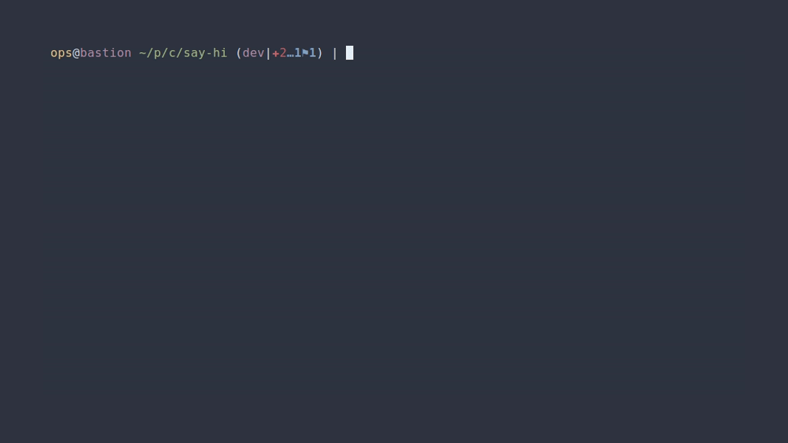

# hi.sh -> sshrc supercharged

---

## EXPERIMENTAL UNTIL v1.0.0-stable RELEASES

NOTE: Project is in active development, many things are subject to change
and this current state is not a representation of final, published quality.
This is a hobby project.

---

[](https://github.com/ivylikethevine/say-hi/actions/workflows/ci.yml)
[](https://github.com/ivylikethevine/say-hi/actions/workflows/ci.yml)
[](https://github.com/ivylikethevine/say-hi/actions/workflows/macos-e2e.yml)
[](https://github.com/ivylikethevine/say-hi/actions/workflows/windows-e2e.yml)

[](https://github.com/ivylikethevine/say-hi/releases)
[](docs/TESTING.md#coverage-and-profiling)
[](https://scorecard.dev/viewer/?uri=github.com/ivylikethevine/say-hi)


**One config directory to rule them all, uniting all shells from all hosts!**

_Don't `ssh`ush your hosts, say `hi`!_


## Contents

- [Every target, the same session](#every-target-the-same-session)
  - [ssh, with a permanent install](#ssh-with-a-permanent-install)
  - [docker](#docker)
  - [podman](#podman)
  - [nomad](#nomad)
  - [kubernetes](#kubernetes)
  - [completion, every backend at once](#completion-every-backend-at-once)
- [Requirements](#requirements)
- [Installation/Usage](#installationusage)
- [Configuration](#configuration)
  - [Hostname, username, and group/tag colors](#hostname-username-and-grouptag-colors)
  - [How it works](#how-it-works)
- [Built from/with/in mind](#built-fromwithin-mind)
  - [Docker / Podman containers](#docker--podman-containers)
  - [Nomad allocations](#nomad-allocations)
  - [Kubernetes pods](#kubernetes-pods)
  - [Windows hosts](#windows-hosts)
- [say-hi and the alternatives](#say-hi-and-the-alternatives)
  - [Compatibility](#compatibility)
- [Testing](#testing)
- [More docs](#more-docs)
- [AI Usage](#ai-usage)
- [Miscellaneous](#miscellaneous)
  - [Regenerating the demo GIFs](#regenerating-the-demo-gifs)
  - [Verifying a release download](#verifying-a-release-download)

## Every target, the same session

The pitch is that `hi` behaves identically whatever is on the other end — an
ssh host, a container, an allocation, a pod — and whatever shell each side
runs. One GIF per backend, deliberately varying both sides, and each one
configured differently: the line under every GIF names the knob it is showing,
so the set reads as a configurable tool rather than one fixed look. The GIF at
the top of this README is the exception on purpose — it is the stock defaults,
with nothing turned off. A last GIF closes the section without being a backend
at all: completion, which answers with every one of them at once. How they are
rendered, and what to catch when you regenerate them, is at the bottom:
[Regenerating the demo GIFs](#regenerating-the-demo-gifs).

### ssh, with a permanent install

The target carries its own `~/say-hi`, so nothing ships over the wire — hi
loads the tree in place and leaves it alone on exit. Client: bash.
Showing `_HI_HEADER_TIMESTAMP=0` and `_HI_HEADER_SYSINFO=0` — set on the _box_,
not the client: a permanent install reads its own config, so this is the demo
whose knob lives on the target.


### docker

A debian/bash container, then an alpine box whose only real shell is zsh —
hi probes and falls back without being told. Client: zsh.
Showing `_HI_PROMPT_END_ZSH` and `_HI_HEADER_CHECK=0` — the same debian target
as the GIF at the top, styled differently from the client side.


### podman

A fish-only alpine container from a fish client: no bash anywhere in the
loop. Same session, same code path as docker.
Showing `_HI_PROMPT_END_FISH` — fish's own prompt separator.


### nomad

A dev agent, one docker-driver job, and `hi <alloc-id-prefix>` straight into
the allocation. Client: bash.
Showing `_HI_HEADER_GHZ=1` and `_HI_HEADER_IDENTITY=0` — the CPU line in GHz,
the identity row off.


### kubernetes

A kind cluster and a bare alpine pod — busybox ash is all it has, which is
hi's aliases-only fallback. Client: zsh.
Showing `_HI_DISABLE_GIT_STATUS=1` — the same prompt, without the git segment.


### completion, every backend at once

Not a session — the roster the sessions come from. `hi <TAB>` answers with the
`Host` entries in `~/.ssh/config` _and_ every running container, allocation and
pod, each tagged with the backend it came from; `hi --<TAB>` answers hi's own
flags, without probing any backend to do it. Client: fish, for the description
column its pager gives every row.



The list stops at eleven rows because fish hands its pager half the screen, so
two ssh hosts spill into "…and 1 more row". That is completion behaving
normally, not the GIF cut short.

## Requirements

- **Client**: `bash` and `base64` (for ssh targets — armors the bootstrap
  payload through the login shell; coreutils, busybox, macOS/BSD and Git Bash
  all ship one), or `docker`/`podman`/`nomad`/`kubectl` for the
  container/alloc/pod backends.
- **bash version**: 3.2 or newer, on both ends — what macOS still ships, so hi
  stays clear of every bash-4-only construct: no `mapfile`/`readarray`
  (`_hi_read_lines` in `common/core.sh` does that job), no associative arrays,
  no namerefs, no `${x,,}`. Enforced twice: `tests/lint/shellcheck_test.sh`
  greps for those constructs, and `tests/targets/ssh_test.sh` runs a real bash
  3.2 container target and fails on so much as one shell error.
- **Target**: `base64` for ssh targets (effectively everywhere — coreutils,
  busybox, macOS/BSD); nothing extra for container/alloc/pod targets. `bash`
  gets the full experience; without it `hi` still lands you in the best shell
  the target has rather than failing outright, with a smaller session. Which
  tier you land in, and what each keeps, is [Compatibility](#compatibility).
- Everything else (client and target) is plain POSIX/bash/zsh/fish shell — no
  compiled artifacts, no package manager, no build step.

## Installation/Usage

- `say-hi/scripts/install.sh`, or `hi --install` once hi is on your `PATH` —
  the same script either way. Re-run it any time; it repairs its own lines,
  even if say-hi moved. Before touching your shell rc files it validates
  whichever of `~/.bashrc`, `~/.zshrc` and `~/.config/fish/config.fish` are
  installed, each with that shell's own syntax checker, and asks whether to
  continue if any have issues
- reload your shell!
- run `hi --configure` any time afterward to revisit the feature toggle
  prompts — header, prompt, personal settings, git status, editors, aliases,
  header details, how much of the package check to show, terminal width, and
  whether hi styles this machine too or only the hosts you say `hi` to —
  without touching the shell rc wiring. Most questions preview their answer;
  the package-check one re-renders the real check at each value you try.
  Answers land in `~/.config/say-hi/settings.sh`; see
  [Configuration](#configuration) below
- run `hi --check-configs` any time to just re-run that shell rc validation,
  without the rest of the install
- run `hi --overlay-init` to put `~/.config/say-hi` under git _in place_: from
  then on `hi --configure` commits its own writes, and a push remote is one
  `git remote add` away. Entirely optional — see
  [docs/CONFIGURATION.md](docs/CONFIGURATION.md)
- run `hi --help` (or `hi -h`) for the short version of all of this: the
  synopsis, the target resolution order, and every flag hi answers itself.
  `man hi` is the long version. Everything hi does not answer is passed to
  `ssh` unchanged
- run `hi --version` to see what is installed — the packaged version, or
  `git describe` in a checkout; the doctor and the connect header show it too
- run `hi --doctor` (or `hi --doctor <target>`, to test one host) when
  something is slow or failing: it reports the tree, the config overlay, every
  backend probed and timed with the same ceilings the header and completion
  use, and — with a target — which backend the name resolves to plus an ssh
  reachability/tooling check, all read-only
- press TAB: `hi <TAB>` completes every target — the `Host` entries in
  `~/.ssh/config` plus every running container, allocation and pod, each
  tagged with the backend it came from — and `hi --<TAB>` completes hi's own
  flags. bash, zsh and fish read the same list (`common/targets.sh`), so the
  three cannot drift; a flag word is answered without probing any backend.
  There is a GIF of both halves above:
  [completion, every backend at once](#completion-every-backend-at-once)
- configure `~/.ssh/config` tags via sshm
- [optional] pin specific colors in `~/.config/say-hi/colors` — everything else
  gets a color automatically. Copy `say-hi/misc/colors` there to start from the
  shipped defaults
  - run `hi --color-preview` to preview what every ssh host/your user resolves
    to
- [optional] copy `say-hi/misc/packages` to `~/.config/say-hi/packages` and
  edit it to your preferences
  - run `hi --packages-preview` to see what each priority means, the colors it
    renders installed and missing packages in, one real example of each from
    your own file, and the check itself as a connect will print it
- say `hi`!
- [optional] modify `say-hi/misc/*` and `say-hi/shells/*` in your checkout to
  your liking —
  though anything with an overlay (`settings.sh`, `colors`, `packages`,
  `aliases.sh`) is better edited in `~/.config/say-hi/`, which
  keeps the checkout clean for `hi --update`
  - tip: the tree is a git checkout, so if you do edit it, push to your own
    fork and clone that on your next device — same setup everywhere, kept in
    sync by `hi --update`
- done with it? `say-hi/scripts/uninstall.sh`, or `hi --uninstall`, is the
  install's inverse: it strips hi's lines back out of your rc files, removes
  the `settings.sh` it wrote, and unlinks `/usr/bin/hi`. It leaves the `say-hi`
  directory alone, and your `colors`/`packages` too — delete those yourself if
  you want them gone

---

Usage: `hi foo` (just like ssh!)

---

Reminder — place local only changes after the "`# hi-config-end`" comment in
the local files.

## Configuration

Your config lives **outside the checkout**, in
`${XDG_CONFIG_HOME:-$HOME/.config}/say-hi/`, and rides along to every host you
say `hi` to in its own small archive — `colors`, `packages` and
`aliases.sh` overlay the tree's copies one file at a time, and `settings.sh`
(what `hi --configure` writes) has no in-tree counterpart at all. The full
picture — the overlay file table, every `_HI_DISABLE_*` feature toggle, the
header-line toggles, and every other
environment variable hi reads (`_HI_SHELL_PREFERENCE`, `_HI_PROMPT`,
`_HI_ASCII`, `_HI_HEADER_GHZ`, ...) — is in
[docs/CONFIGURATION.md](docs/CONFIGURATION.md).

### Hostname, username, and group/tag colors

Every username and hostname gets a color deterministically derived from its
name — nothing to generate, nothing that can go missing. To pin one instead,
add a line to `say-hi/misc/colors` (`username,root,red` /
`hostname,prod-db,yellow` / `hosttag,desktop,green`); `hosttag` entries match
the _leftmost_ tag in a `# Tags: ...` comment directly above a `Host` line in
`~/.ssh/config`. `hi --color-preview` shows what every ssh host and your user
currently resolve to, in their actual colors.

### How it works

1. `hi.sh` runs on the client, tars `say-hi/` and sends it to the target, which
   unpacks it into a `/tmp` directory. `$_HI_PAYLOAD` at the top of `hi.sh` is
   the authoritative allow list — no `.git`, `scripts/`, `tests/`, `docs/` or
   CI. Your overlay (see [Configuration](#configuration)) follows in a second,
   much smaller archive, landing in a `config/` of its own so your `aliases.sh`
   stays additive. A target that already has its own `say-hi` gets neither: hi
   loads that tree in place and it reads its own overlay.
2. Both are base64-armored into one script and written over the **stdin** of an
   ssh connection the session then reuses — not argv, which Linux caps at 128KB
   however big `ARG_MAX` says it is. Every shell file is comment-stripped on
   the way into that archive — the checkout keeps its comments, the wire does
   not, which is about 40% of it; set `_HI_KEEP_COMMENTS=1` to ship the tree
   verbatim when you need to read the real source on a target.
3. That assembled script is what `hi` prints the size of on connect, and what
   the payload badge measures — for a _default_ configuration, since a client
   whose overlay turns off the editor overrides or the OSC 52 clipboard sends
   less. Read it as the per-session wire cost, not as the package badge beside
   it: that one is what a release downloads and what it occupies on disk, which
   is the larger figure, `scripts/` and the docs shipping in a package and
   never over the wire.
4. On the target, `load.sh` prints the header, appends hi's shell configs to
   the host's own rc files, and drops you into **your login shell** when hi
   styles it (bash, zsh, fish), else the best the target has of
   `$_HI_SHELL_TREE` — `fish > zsh > bash > dash > ash > sh`.
   `_HI_SHELL_PREFERENCE` is that rule as a setting. Where there is no bash at
   all the choice comes from `$_HI_SHELL_LADDER`, that same list with bash
   taken out.
5. On exit, `load.sh`'s `trap` strips those additions back out and the `/tmp`
   directory is removed.
6. `hi <target> 'some command'` skips the session and runs the command there
   instead, the way `ssh` does.

The bootstrap is plain POSIX `sh`, so a target with no `bash` still gets a
session — the best plain shell it has, with the aliases loaded, rather than the
full `load.sh`. For ssh targets hi first checks, over the same connection so it
costs no extra authentication, whether a permanent say-hi is already there; if
so it uses that in place and copies nothing. It does not assume `~/say-hi`: the
check reads the `_HI_HOME` line `install.sh` wrote into that target's login rc
files (or `/etc/profile.d` for a packaged install), then falls back to the home
directory, and finally to the places an install lands when nothing declared it —
`~/.local/share`, `/usr/local/share`, `/opt`, `/usr/share` and Homebrew's
default keg prefixes, which is what finds a `brew install`ed target that never
had its shells wired up. A tree installed anywhere is still found and reused.
`hi --doctor` prints the wire size and the unpacked size, labeled.

**_IMPORTANT: Local-only changes MUST stay in `~/.bashrc`, `~/.zshrc`,
`~/.config/fish/config.fish`, etc. — anything in
`${XDG_CONFIG_HOME:-$HOME/.config}/say-hi/` is copied to every host you say
`hi` to._**

## Built from/with/in mind

- [sshrc](https://github.com/cdown/sshrc) — _from_ — (became `hi.sh`)
- [sshm](https://github.com/Gu1llaum-3/sshm) — _with_ — (optional, but _highly_
  recommended to configure `~/.ssh/config` hosttags)
- [bat](https://github.com/sharkdp/bat) — _in mind_ — (essentially my reason to
  get the aliases.sh fallthrough logic to work as portably as possible)
- [fish](https://github.com/fish-shell/fish-shell) — _with_ — (my preferred
  shell because its defaults/built-ins are extremely easy to understand, but
  one that is not POSIX-compliant)

### Docker / Podman containers

`hi <name>` also works against a running docker or podman container. If
`<name>` isn't a `Host` in `~/.ssh/config` but is a running container (by name
or ID, docker checked first), `hi` copies its tree in and chainloads
`load.sh` exactly as the ssh path does, for an identical session. No armoring
is needed (`docker exec -i`/`podman exec -i` pass stdin as raw bytes), and
cleanup happens on exit. Podman's CLI is close enough to reuse the same command
shapes. The container needs `bash` for the full experience; without it `hi`
drops you into the best plain shell `$_HI_SHELL_LADDER` finds there, with the
aliases and a warning.

### Nomad allocations

`hi <alloc-id>` also works against a running Nomad allocation (matched by
ID/prefix, after the ssh-host and container checks) — same session, same code
path as docker. Since `nomad alloc exec` has no `docker cp`/`-e` equivalent,
files stream in with `exec -i` + `cat >` and env vars go through a
`sh -c "export ...; exec ..."` wrapper. A multi-task allocation picks its task
with `hi <alloc-id>/<task>`, which becomes `nomad alloc exec -task <name>`; a
plain `hi <alloc-id>` is unchanged, and completion offers the pairs for any
allocation that has more than one task.

### Kubernetes pods

`hi <pod-name>` also works against a running Kubernetes pod (checked last,
after ssh/docker/podman/nomad) — same idea again, using `kubectl exec` with
`--` separating its own flags from the remote command. Uses whatever
context/namespace your `kubectl` is currently pointed at; a multi-container pod
picks its container the same way Nomad's tasks do — `hi <pod>/<container>`,
which becomes `kubectl exec -c <name>`. Without the suffix `kubectl` still
falls back to the pod's first container with a warning, so the suffix is how
you say which one you meant; completion offers `pod/container` for every pod
that has more than one.

### Windows hosts

`hi <target>` works against Windows OpenSSH targets too, at whatever level the
target supports:

- **WSL, Git Bash, Cygwin or MSYS2 reachable on `PATH`**: the full experience
  (header, colors, git prompt, aliases) — same code path as any other ssh host.
- **Stock Windows OpenSSH with no `bash` at all**: `hi` falls back to a plain
  interactive PowerShell session (no say-hi styling — that's bash-only) rather
  than failing outright. It still costs one authentication: hi writes its
  bootloader over the first of two calls multiplexed on the _same ssh
  connection_, and a target where that write cannot run `sh -c` is a target
  with no POSIX shell, which is exactly what the fallback is for. `DefaultShell`
  set to PowerShell lands in the same place.

**Installing hi _on_ Windows:** use WSL. The `.deb` from the releases page
installs into a WSL distribution unchanged — `/etc/profile.d/say-hi.sh`,
`/usr/bin/hi`, everything as on any Debian — and WSL is where a Windows
developer already using `ssh`/`docker`/`kubectl` most likely works.

## say-hi and the alternatives

How say-hi compares to `sshrc`, `xxh`, `kyrat`, `sshdot` and `homeshick`, which
adjacent tools compose with it rather than compete, what actually makes it
different, and where another tool is the better choice:
[docs/ALTERNATIVES.md](docs/ALTERNATIVES.md).

### Compatibility

Two questions, because hi answers them at two different moments.
**Legend:** ✅ exercised by a suite on every run · 🟡 expected to work, nobody
has proven it · ⚠️ works, reduced · ❌ not supported.

**1. The target's OS** — can hi land a session there at all?

| target OS                                     | result                                                                                                                                                    | proven by                                                                                   |
| --------------------------------------------- | --------------------------------------------------------------------------------------------------------------------------------------------------------- | ------------------------------------------------------------------------------------------- |
| Linux, glibc (Debian/Ubuntu/Fedora/Arch…)     | ✅ full session                                                                                                                                           | `tests/targets/ssh_test.sh`, on Debian bookworm                                             |
| Linux, musl + busybox (Alpine…)               | ✅ full session with `bash` installed, ⚠️ aliases-only without                                                                                            | `ssh_test.sh`, on Alpine 3.24                                                               |
| macOS                                         | 🟡 full session — bash 3.2 is what it ships, and the suite runs a real bash 3.2 target; the client half (BSD `sed`/`mktemp`/`base64`) is unit-tested only | `ssh_test.sh` bash-3.2 case; `.github/workflows/macos-e2e.yml` is written but has never run |
| WSL                                           | 🟡 it is Linux, and the `.deb` installs into it unchanged                                                                                                 | —                                                                                           |
| Windows, with Git Bash/Cygwin/MSYS2 on `PATH` | 🟡 full session, same code path as any ssh host                                                                                                           | `.github/workflows/windows-client.yml` (client side) and `windows-e2e.yml` (target side), both written, neither run yet |
| Windows, stock OpenSSH (`cmd.exe`/PowerShell) | ⚠️ plain PowerShell session, no hi styling — the fallback is deliberate, not a failure                                                                    | `windows-e2e.yml`, the target-side half above, never run                                    |
| \*BSD, Solaris/illumos                        | 🟡 nothing in hi is Linux-specific past the header's `/proc` probes, which degrade to `?`                                                                 | —                                                                                           |

**2. The shell you end up _in_** — what hi hands you once it is on the target.

| session shell                                    | result                                                                | note                                                                                                                                                                                                                                                                                           |
| ------------------------------------------------ | --------------------------------------------------------------------- | ---------------------------------------------------------------------------------------------------------------------------------------------------------------------------------------------------------------------------------------------------------------------------------------------- |
| `bash` ≥ 3.2                                     | ✅ full: header, prompt, git status, aliases, editor configs          | 3.2 is the floor because macOS still ships it                                                                                                                                                                                                                                                  |
| `zsh`                                            | ✅ full                                                               | `shells/zsh.zsh`                                                                                                                                                                                                                                                                               |
| `fish`                                           | ✅ full                                                               | `shells/config.fish`                                                                                                                                                                                                                                                                           |
| `sh`/`dash`/`ash` (no bash on the target)        | ⚠️ aliases and a colored `user@host` prompt, with a warning saying so | no header and no git segment - those need bash                                                                                                                                                                                                                                                 |
| `nushell`, `elvish`, `xonsh`, `ion`, `oil`/`osh` | ❌ **decided against**, not pending                                   | see the table below. You still get a session — hi lands you in the best of `$_HI_SHELL_TREE` the target has                                                                                                                                                                                    |
| PowerShell                                       | ❌                                                                    | bash-only by design                                                                                                                                                                                                                                                                            |

**Shells hi does not style, and why that is settled.** Each would need its own
rc in `shells/` (prompt, aliases, completion) plus a tier in the fallback
ladder in `hi.sh`'s `_hi_remote_suffix` and `load.sh`'s `load()`.

| shell        | status                          | why                                                                                                                                                                                                                                                                                                                                                                  |
| ------------ | ------------------------------- | -------------------------------------------------------------------------------------------------------------------------------------------------------------------------------------------------------------------------------------------------------------------------------------------------------------------------------------------------------------------- |
| `elvish`     | **decided against**             | its own language, so the prompt and aliases would be a second implementation to keep in sync forever, for an audience hi has no evidence of. A `shells/rc.elv` is what it would take, and nobody has asked                                                                                                                                                           |
| `xonsh`      | **decided against**             | Python — a third implementation, on the same terms as elvish and with the same answer                                                                                                                                                                                                                                                                                |
| `tcsh`/`csh` | **decided against**             | different rc syntax _and_ no `$ENV` equivalent, so there is no hook to land on at all: it would need its own rc and its own delivery mechanism                                                                                                                                                                                                                       |
| `nushell`    | **decided against**             | Nu is not POSIX, so it can source none of `common/`                                                                                                                                                                                                                                                                                                                  |
| `ksh`/`mksh` | **decided against** | they land in the `sh` tier like any other bash-less shell - aliases and the colored prompt, no header. A ksh-specific tier once existed for the sake of a live git segment; it was removed as not worth a second POSIX implementation to keep in sync |
| PowerShell   | not a POSIX shell               | the greeting hi prints there is the whole extent of it                                                                                                                                                                                                                                                                                                               |

Using one of these as a _login_ shell still works, and always did — hi lands
you in the best of `$_HI_SHELL_TREE` the target actually has. Only the
_session_ shell is limited, and only for the three above.

**If you use a shell framework**, hi lands you in your own login shell, so it
loads normally — that is what `_HI_SHELL_PREFERENCE`'s default (`login`, then
the styled head of `$_HI_SHELL_TREE`: `fish zsh bash`) means.
`tests/targets/framework_test.sh` tests oh-my-zsh, powerlevel10k, starship and
bash-it against hi, each asserting the session comes up with no shell errors
and that hi neither changed zsh's array base under them nor dropped their
`PROMPT_COMMAND`.

**Both tables above assume hi can reach the target in the first place.** What it
can reach - and the verdict on every runtime weighed and left off the roster,
LXC/Incus, `systemd-nspawn`, WSL, `nerdctl`, jails, zones and the rest - is
[docs/TARGETS.md](docs/TARGETS.md).

## Testing

`tests/test_runner.sh` (reachable as `hi --test` once installed) runs the suite
and prints a colored pass/fail summary; `--group fast` is what CI runs on every
push/PR. The runbook — all four suite groups, the parallel container cases, the
lint gate, relaying, `_HI_HOME`, and why the tests are local-only — is in
[docs/TESTING.md](docs/TESTING.md).

## More docs

- [docs/CONFIGURATION.md](docs/CONFIGURATION.md) — the config overlay, every
  feature toggle and environment variable hi reads
- [docs/TARGETS.md](docs/TARGETS.md) — every target hi answers to, every one
  weighed and left off, and why each answer is settled
- [docs/ALTERNATIVES.md](docs/ALTERNATIVES.md) — sshrc, xxh, kyrat, sshdot and
  homeshick side by side; what makes say-hi different, and when another tool is
  the better choice
- [docs/TESTING.md](docs/TESTING.md) — the test runner, suite groups, parallel
  cases, the lint gate, relaying
- [docs/GLOSSARY.md](docs/GLOSSARY.md) — the named idioms the code's
  `GLOSSARY:` comment tags point at; load-bearing for reading `common/`, and
  drift-checked by the lint suite
- [docs/SECURITY.md](docs/SECURITY.md) — reporting, and what hi touches on a
  target
- [docs/PACKAGING.md](docs/PACKAGING.md) — the publishing runbook: cutting a
  release, the per-channel steps, the channels weighed and not shipped, and the
  reproducibility contract
- [docs/ROADMAP.md](docs/ROADMAP.md) — what is planned, what each item is
  blocked on, and the one-time setup the release channels wait on

## AI Usage

Heavily inspired by:
[Dictionarry/Profilarr's AI Transparency Statement](https://v2.dictionarry.dev/ai-transparency)

This started as code written entirely by
[me](https://github.com/ivylikethevine), but I have used generative AI to write
large parts of it. All of the code here is my _responsibility_ regardless: AI
is a tool, not an owner of a project. I have personally understood, reviewed
and approved all of the AI-generated code in this repository, and _mainline
releases_ carry the same accountability to me as anything I write and publish
myself.

---

## Miscellaneous

### Regenerating the demo GIFs

[`docs/tapes/generate.sh`](docs/tapes/generate.sh) renders all of them: one
`vhs` run per tape, cheapest first, with a `fixtures.sh down` in between — no
tape cleans up after itself — and a summary of what rendered, what stood down
for a missing backend, and what failed. Name tapes to render a subset
(`generate.sh docker kube`); `--list` shows them, `--down` clears up after a
crashed run.

**Seven of the eight render themselves.**
[`.github/workflows/demos.yml`](.github/workflows/demos.yml) runs every tape but
`demo` on the self-hosted runner — the only machine with all four backends — on
a tape change, weekly, or on dispatch, and hands the GIFs to the Pages build,
which lays them over the committed copies at the same paths. Nothing is
committed back: a bot commit on top of the author's is what branch protection
refuses, and it is the same reason the tests badge is published rather than
written into this file.

The top-of-README demo is the one that goes quietly wrong: it claims to be the
stock defaults, so it is stale the moment the header, the prompt or the tape
changes, and nothing about looking at it says so.
[`.githooks/demo_staleness.sh`](.githooks/demo_staleness.sh) is the reminder —
it compares `demo.gif`'s last commit against the tape, the fixtures and the
shipped tree, and says which of them moved since. Run it by hand, or wire it up
as a pre-commit hook:

```sh
git config core.hooksPath .githooks
```

It only ever warns. Rendering a binary nobody looked at is the thing this
section exists to argue against, so the hook will not do it for you and will
never block a commit.

By hand it is one `vhs docs/tapes/<name>.tape` per GIF from the repo root, with
the backend running and `hi` on PATH; `docs/tapes/fixtures.sh` builds every
target the tapes connect to, `fixtures.sh down` removes them. There is one more
in [CONFIGURATION.md](docs/CONFIGURATION.md#colors) — `color_preview.tape`, the
only one needing no backend at all.

Two things to get right when you do it that way — the two the script exists to
take care of. `hi` on `$PATH` must be _this_ checkout (`/usr/bin/hi` may point
elsewhere; the script shims its own onto the front of `$PATH`). And the target
image builds from `HEAD`, so uncommitted work shows on the client side of the
GIF but not the target's: render from a commit, or set
`HI_DEMO_SOURCE=worktree`, which is what the script picks for you on a dirty
tree.

Both sides of every GIF are staged, not inherited. Each tape sources a small rc
`fixtures.sh` writes, giving the outside shell hi's own prompt under a chosen
`user@host` instead of the renderer's — and every target gets an explicit
hostname rather than a backend's random hex ID. The pairs vary on purpose:
docker's client is `cache-1` and one of its targets is `cache-1` too, while the
rest say `hi` somewhere they are not.

### Verifying a release download

Releases ship a `SHA256SUMS`, signed build provenance, and a detached
[minisign](https://jedisct1.github.io/minisign/) signature over the sums (the
offline half — no `gh`, no network, one static public key):

```sh
sha256sum -c --ignore-missing SHA256SUMS                        # the bytes match the release
minisign -Vm SHA256SUMS -P 'RWTDcJ3LGWayrAxK6mbMysyOF8mNLOmMUGRl4YSWk5KIoayS+lW0Fy1L'
gh attestation verify say-hi_*_all.deb --repo ivylikethevine/say-hi # which CI run built them
```

That covers **every** file on the release, `say-hi-<version>.tar.gz` included —
the source tarball the Homebrew formula and the AUR package build from is one
the release built and attested, not GitHub's auto-generated `/archive/` one,
which carries neither sum nor signature. So
`gh attestation verify say-hi-*.tar.gz --repo ivylikethevine/say-hi` answers for
the sources the same way the line above answers for the `.deb`.
