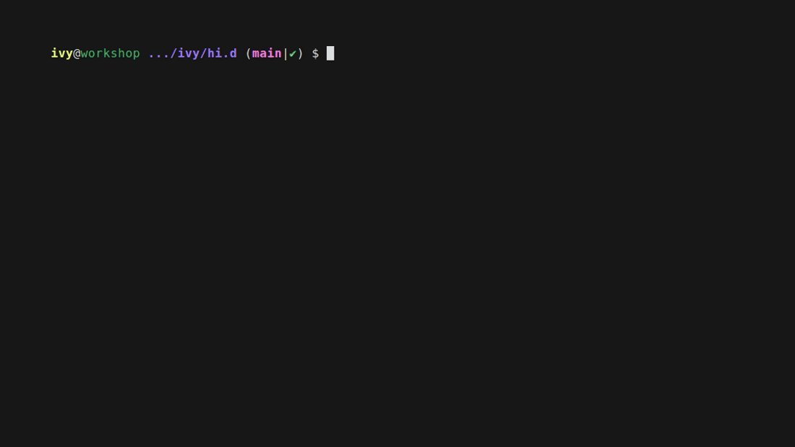

# Configuration

Your config lives **outside the checkout**, in
`${XDG_CONFIG_HOME:-$HOME/.config}/say-hi/` (`$_HI_CONFIG_DIR`). `colors`,
`packages` there override the tree's copies, one file at a
time - anything you haven't overridden keeps tracking the default the tree
ships, so `hi --update` still delivers changes to the rest. `aliases.sh` is the
one that adds rather than replaces, loading after the tree's own so yours win.
`settings.sh` has no in-tree counterpart at all: `hi --configure` only ever
writes it here.

| overlay file                 | overrides        | what it is                                                                                                                            |
| ----------------------------- | ----------------- | ---------------------------------------------------------------------------------------------------------------------------------------------------------------------------------- |
| `~/.config/say-hi/settings.sh` | -                | what `hi --configure` writes                                                                                                            |
| `~/.config/say-hi/colors`      | `misc/colors`    | your color pins                                                                                                                       |
| `~/.config/say-hi/packages`    | `misc/packages`  | what the package check looks for                                                                                                      |
| `~/.config/say-hi/aliases.sh`  | -                | your own aliases, sourced **after** `misc/aliases.sh` and `misc/personal.sh` so yours win - additive, never a replacement, and in the same POSIX+fish subset |

This is what keeps configuring say-hi from dirtying the checkout (so
`hi --update`'s `git pull` keeps applying cleanly), and why the tree never has
to be writable at all - it can be root-owned, installed by a package manager.
All of it rides along to every host you say `hi` to, in its own small archive.

Want history on it? `hi --overlay-init` makes `~/.config/say-hi` a git repo _in
place_: from then on `hi --configure` commits its own settings writes,
`hi --doctor` reports the commit count, and a push remote is one
`git remote add` away. Entirely optional. (Keeping the same directory in chezmoi
or yadm works just as well - see [ALTERNATIVES.md](ALTERNATIVES.md).)

Everything below is an environment variable, checked where it's used.
`hi --configure` writes your answers to `~/.config/say-hi/settings.sh`, which
every shell sources ahead of `common/paths.sh` - a plain `#!/bin/sh` script of
`export NAME=value` lines, valid in sh, bash, zsh and fish alike. You never have
to use `hi --configure`: exporting any of these by hand works just as well, and
takes precedence for that shell. The one exception is marked read-only in its
row: `common/paths.sh` derives it on every source, so an exported value never
lasts.

## Contents

- [Features](#features)
- [Colors](#colors)
- [Two sessions to the same host](#two-sessions-to-the-same-host)
- [Header details](#header-details)
- [Everything else](#everything-else)

## Features

Each is **on by default**; set it to `1` to turn that piece off.

| variable                 | turns off                                                                                                                             |
| ------------------------ | ------------------------------------------------------------------------------------------------------------------------------------- |
| `_HI_DISABLE_HEADER`     | the whole connect/disconnect header, every line of it                                                                                 |
| `_HI_DISABLE_PROMPT`     | the colored `user@host` prompt, leaving your shell's own                                                                              |
| `_HI_DISABLE_PERSONAL`   | personal shell settings - history size, keybindings, completion tweaks                                                                |
| `_HI_DISABLE_GIT_STATUS` | the git segment in the prompt                                                                                                         |
| `_HI_DISABLE_EDITORS`    | the `vim`/`nano` config overrides                                                                                                     |
| `_HI_DISABLE_ALIASES`    | the personal aliases in `misc/personal.sh` - not the editor and `hi_copy` aliases `misc/aliases.sh` installs, which are the product. Setting it also keeps `personal.sh` off the ssh payload entirely |
| `_HI_DISABLE_OSC52`      | the OSC 52 clipboard - yanks in `vim` and the `hi_copy` alias                                                                         |
| `_HI_DISABLE_LOCAL`      | all of the above **on this machine only** - hi still styles the hosts you visit                                                       |

`_HI_DISABLE_LOCAL` is the odd one out: "leave my own machine alone, but give me
hi everywhere I connect to". It's told apart from a real session by
`_HI_REMOTE_SESSION`, which `load.sh` exports on a target and a local shell's
own rc never does.

`_HI_DISABLE_OSC52` turns off the one feature that reaches back _through_ the
connection: a yank in `vim` on a target, or anything piped into `hi_copy`, is
base64'd into an
[OSC 52](https://invisible-island.net/xterm/ctlseqs/ctlseqs.html#h4-Operating-System-Commands)
escape and written to the tty, so your local terminal emulator - not the host -
puts it on **your** clipboard. No X11 forwarding, no clipboard daemon, nothing
installed on the target. Only the unnamed register is sent, so `"ay` stays
local. Terminal support varies (tmux needs `set -g allow-passthrough on`; zellij
handles OSC 52 itself, so under `$ZELLIJ` the escape goes through raw and
unwrapped), which is why it's a toggle like everything else; `shells/osc52.sh`
is the whole implementation if you want to read what gets emitted.

## Colors

Every username and hostname resolves to a color derived from its own name, so an
unpinned host looks the same from every machine you say `hi` from - nothing to
generate, nothing that can go missing. Pin the ones that matter in
`~/.config/say-hi/colors`: `username,root,red`, `hostname,bastion,yellow`, or
`hosttag,prod,red` to color every host carrying a `# Tags: prod` comment above
its `Host` line in `~/.ssh/config`. A pin always beats the hash.

`hi --color-preview` answers what that adds up to - every host in your ssh
config and every user it knows of, drawn in the colors themselves, each row
naming the rule it matched:

## Two sessions to the same host

hi grafts its rc block into the target's `~/.bashrc` (and `~/.zshrc`, and fish's
config) on connect, and strips it on exit. The block is grafted **once** and
removed by **whoever leaves first** - not by whoever put it there. So of two
overlapping sessions to one host, the first to exit takes the block away from
the one still running.

Nothing you are already using breaks. A running shell read its rc when it
started, the session trees are per-`mktemp` so neither session can delete the
other's, and the graft is guarded on `$_HI_HOME` so it could never source a
stranger's tree anyway. What you lose is a shell started **afterwards** inside
the surviving session - `su`, a nested login - which comes up
bare, exactly as if you had ssh'd in without hi.

This is deliberate rather than unnoticed. Refcounting the graft is the
alternative, and a refcount has to live somewhere on the target that survives a
crashed session - persistent state on a machine hi promises to leave as it found
it ([SECURITY.md](SECURITY.md)'s footprint section). Reconnecting is the
workaround, and `tests/load/load_test.sh` pins the behaviour so it cannot change
by accident.

## Header details

Each is **on by default**; set it to `0` to hide that line. All are ignored when
`_HI_DISABLE_HEADER=1`.

| variable               | hides                                                            |
| ---------------------- | ---------------------------------------------------------------- |
| `_HI_HEADER_BANNER`    | the `~~~ Connected [host] ~~~` line, on connect _and_ disconnect |
| `_HI_HEADER_TIMESTAMP` | the date/time line                                               |
| `_HI_HEADER_SYSINFO`   | the OS / CPU / RAM line                                          |
| `_HI_HEADER_IDENTITY`  | the git identity / containers / ssh key line                     |
| `_HI_HEADER_CHECK`     | the installed-packages check (`misc/packages`)                   |

## Everything else

| variable               | default               | what it does                                                                                                                                                                                                                                                                                                   |
| ----------------------- | ---------------------- | -------------------------------------------------------------------------------------------------------------------------------------------------------------------------------------------------------------------------------------------------------------------------------------------------------------- |
| `_HI_MAX_WIDTH`        | `80`                  | terminal columns the header and banner are drawn to                                                                                                                                                                                                                                                            |
| `_HI_HOME`             | derived               | the **parent** of your `say-hi` directory - everything resolves `$_HI_HOME/say-hi`. Each entry point derives it from its own path when unset; set it to override                                                                                                                                                                                                                                 |
| `_HI_TARGETS_TTL`      | `5`                   | seconds `hi <TAB>` reuses its target list for; `0` disables the cache                                                                                                                                                                                                                                          |
| `_HI_PROBE_TIMEOUT`    | `2`                   | seconds any one backend CLI gets, during completion and in the header                                                                                                                                                                                                                                          |
| `_HI_SSH_CONFIG`       | `~/.ssh/config`       | read-only: where ssh hosts and their `# Tags:` comments are read from. Derived from `$HOME` by `common/paths.sh` every time it is sourced, so exporting your own value does not survive - point `$HOME` at another tree if you need a different config                                                          |
| `_HI_ASCII`            | by locale             | `1` forces ASCII stand-ins for the banner/prompt/packages glyphs (`^ ok x` for `↑ ✓ ✗`), `0` forces the glyphs; unset asks the locale, so a `LANG=C` target degrades cleanly instead of printing mojibake                                                                                                      |
| `NO_COLOR`             | unset                 | not hi's variable but [the convention](https://no-color.org): any non-empty value renders everything - header, prompts, git segment - without color, and hi ships your client-side choice to the target next to `_HI_ASCII`                                                                                    |
| `_HI_PROMPT`           | unset                 | `starship` hands the prompt to [starship](https://starship.rs) when the target has it, keeping hi's header and aliases. Never auto-detected, and a target without starship silently keeps hi's own. hi does not ship starship - a multi-MB binary against a ~48KB payload |
| `_HI_SHELL_PREFERENCE` | `login` + `$_HI_SHELL_TREE` | which shell a session runs in: an ordered list of `bash`/`zsh`/`fish`, plus `login` for "your own login shell". The default tail is `common/core.sh`'s `$_HI_SHELL_TREE` (`fish zsh bash dash ash sh`) filtered to the shells hi styles, i.e. `fish zsh bash` - the same list `hi.sh`'s no-bash `$_HI_SHELL_LADDER` is cut from, so the two orderings cannot disagree. First one installed on the target wins; `bash` is the floor, since that is what `load.sh` needs to run at all. |
| `_HI_PROMPT_END`       | per shell             | the character each prompt ends with, when you want the same one everywhere; the three below win over it                                                                                                                                                                                                        |
| `_HI_PROMPT_END_BASH`  | `\$`                  | bash's prompt separator (`\$` is bash's own escape for "`$`, or `#` for root")                                                                                                                                                                                                                                 |
| `_HI_PROMPT_END_ZSH`   | `>`                   | zsh's prompt separator - zsh prompt escapes work here, so `%#` behaves as it does anywhere else in `PS1`                                                                                                                                                                                                        |
| `_HI_PROMPT_END_FISH`  | `\|`                  | fish's prompt separator; root still gets `#` regardless                                                                                                                                                                                                                                                        |
| `_HI_TERM_FALLBACK`    | `1`                   | on ssh targets missing a terminfo entry for your `TERM` (ghostty's `xterm-ghostty`, typically), swap it for `xterm-256color` before the session starts; `0` keeps the original `TERM`                                                                                                                          |
| `_HI_HEADER_GHZ`       | `0`                   | `1` shows the header's CPU line as `x.xxx/x.xxx GHz` instead of the default whole-MHz pair; ignored when `_HI_HEADER_SYSINFO=0`                                                                                                                                                                                |
| `_HI_PACKAGES_MIN_PRIORITY` | `1`              | the lowest `misc/packages` priority the header's check will print, and the main dial on how long that check is. The file ranks every entry 0-5, and every rank reports what is _missing_ as well as what is there - a target you visit often is where a nudge to install your own preferred tools belongs - so this is what decides how far down that list you want to hear about. On a well-equipped machine: `1` is what ships and drops the trivia tier (about ten lines), `0` puts it back and prints everything (a dozen), `2` drops the optional extras too (about four), `3` leaves your favorites and what your workflow depends on (two), and above `5` the check prints nothing at all rather than a blank line. Rank 4 is the one that behaves differently by design: it is silent when those tools are present and speaks only when they are not, so a bare target still says what it is missing at any floor up to 4. `hi --configure` asks for this one with a live preview - it re-renders the real check at each value you type, so you pick the length you want by looking at it. `hi --packages-preview` marks the ranks it silences `below floor` and counts them under the legend, so the setting is legible before you connect anywhere |
| `_HI_ENABLE_FISH_ALIAS_ABBR` | `0`             | fish only, off by default: `1` gives every alias hi defines a real `abbr`, so it expands to the full command on the line before you run it - it rewrites what your command line and history literally say, hence opt-in (`hi_abbr_aliases` does the work and is callable by hand in any fish shell). Not in the `_HI_DISABLE_*` table above since it's fish-specific, not one of `core.sh`'s shared toggles |

`_HI_TARGETS_TTL` and `_HI_PROBE_TIMEOUT` exist because completion runs on
**every TAB** and the header runs **before you get a shell**: a docker daemon
that's down or a `kubectl` pointed at a dead cluster would otherwise hang there
with no upper bound.
