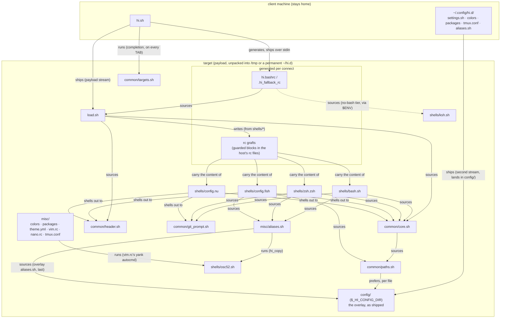

# How the files relate

The [README's "How it works"](../README.md#how-it-works) steps are the prose; this diagram is the
mechanism. Boxes are files (or the few directories acting as one), and every arrow is one of the four ways
a file here ever reaches another:

- **sources** - shell `source`/`.`, same process
- **shells out** - a `bash -c "source ...; fn"` subprocess (how fish and nu
  reach code written in bash)
- **runs** - executed as its own subprocess, never sourced
- **generates / writes** - the file exists only because another wrote it

Deliberately coarse: file granularity, those four edge kinds. What is _not_
drawn matters too — `hi.sh` itself, `scripts/`, `tests/` and `docs/` never
ship; the payload is `$_HI_PAYLOAD`, and the bench suite enforces its size.

Three edges carry most of the design:

- **`hi.sh` never ships.** Everything on the target side has to work without
  it, which is why `load.sh` is the target's entry point and a peer of
  `hi.sh` at the tree root rather than a `common/` library.
- **fish and nu never source bash.** Their arrows to `core.sh`,
  `header.sh` and `git_prompt.sh` are _shell-outs_ - one implementation of
  the header, palette and git segment, rented per call, instead of three
  kept in sync (GLOSSARY: nu session tier).
- **`osc52.sh` is only ever run.** Both `hi_copy` and vim's yank autocmd
  execute it as a file at `$_HI_OSC52`, which is why the tmux/screen/zellij
  wrapping lives in one place and the file cannot be merged into
  `aliases.sh`.

The grafts deserve one footnote: each carries a tree-exists guard
(GLOSSARY: graft crash guard), so an arrow into a deleted `/tmp` tree goes
quiet instead of erroring - the diagram's dashed reality after a hard kill.
